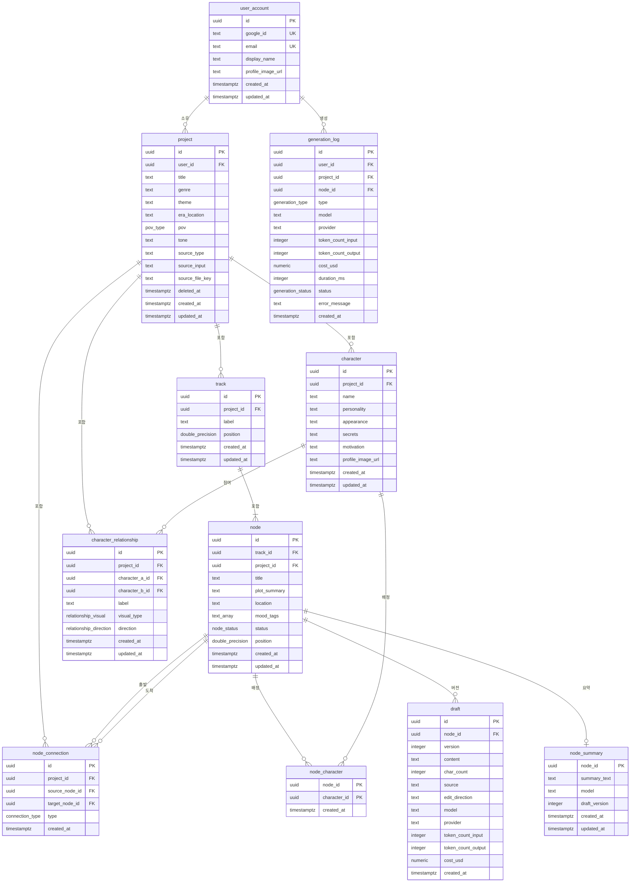

# Narrex — 데이터베이스 설계

**상태:** 초안
**작성자:** zzoo
**작성일:** 2026-03-07
**PRD 참조:** docs/prd.md, docs/prd-phase-1.md
**설계 문서 참조:** docs/design-doc.md

---

## 1. 개요

### 1.1 저장소 아키텍처

설계 문서(Section 4.2) 기반:

| 저장소 | 데이터 | 일관성 |
|--------|--------|--------|
| **Neon (PostgreSQL)** | 프로젝트, 노드, 트랙, 연결, 캐릭터, 관계, 초안, 요약, 사용자 | 강한 일관성 (ACID) |
| **Upstash Redis** | 프롬프트 컨텍스트 캐시, 속도 제한, 리프레시 토큰 차단 목록 | 최종 일관성 (TTL) |
| **Cloudflare R2** | 가져온 파일, 캐릭터 이미지, 내보낸 원고 | 최종 일관성 |

이 문서는 PostgreSQL 스키마만 다룹니다. Redis와 R2는 설계 문서에 기술되어 있습니다.

### 1.2 설계 원칙

1. **3NF까지 정규화, 의도적 비정규화.** 모든 테이블은 최소 3NF. 유일한 의도적 비정규화는 `node.project_id` (track.project_id로 유도 가능) — 컨텍스트 어셈블리, 권한 검사, 프로젝트 수준 쿼리에서 track 조인을 제거하기 위함.

2. **모든 PK에 UUID 사용.** 외부 노출에 안전(열거 불가), 분산 환경 친화적. `gen_random_uuid()` (UUID v4, PG 13+ 내장) 사용. 예상 규모(<100만 행)에서 성능 영향 무시 가능.

3. **드래그 앤 드롭을 위한 분수 정렬.** `position` 컬럼은 `DOUBLE PRECISION`, 초기 간격 1024.0. 삽입 시 중간값 사용. 간격이 0.001 미만이면 재정규화. 매번 형제 노드를 재정렬하지 않아도 됨.

4. **프로젝트만 소프트 삭제.** 프로젝트는 `deleted_at TIMESTAMPTZ` 사용 — 사용자가 복구할 수 있음. 노드, 트랙, 캐릭터는 프로젝트의 `ON DELETE CASCADE`로 하드 삭제. 생성 로그는 `ON DELETE SET NULL`로 비용 데이터 보존.

5. **안정적인 값 집합에 ENUM 사용.** 노드 상태, 연결 유형, 관계 유형 — PRD에 3~5개 값으로 정의되었으며 변경 가능성 낮음. 값 추가는 용이(`ALTER TYPE ... ADD VALUE`); 빈번한 변경이 필요하면 룩업 테이블로 전환.

6. **모든 타임스탬프에 TIMESTAMPTZ.** 시간대 인식 UTC.

7. **VARCHAR 대신 TEXT.** PostgreSQL에서 성능 차이 없음. 필요시 CHECK 제약으로 길이 제한.

### 1.3 네이밍 규칙

```
테이블:       snake_case, 단수 (user_account, node, character)
컬럼:         snake_case, 테이블 접두사 없음 (name, character_name 아님)
PK:           id (UUID)
FK:           참조_테이블_id (user_id, project_id, track_id)
인덱스:       idx_{테이블}_{컬럼}
제약조건:     {유형}_{테이블}_{컬럼} (uq_, chk_)
Enum:         snake_case (node_status, connection_type)
트리거:       trg_{테이블}_{이벤트}
```

### 1.4 설계 문서 대비 차이점

| 항목 | 설계 문서 암시 | DB 설계 결정 | 이유 |
|------|---------------|-------------|------|
| 노드 위치 | 미지정 | `DOUBLE PRECISION` 분수 정렬 | 드래그 앤 드롭 시 O(n) 재번호 매기기 방지. 표준 패턴 (Figma, Linear). |
| 초안 저장 | "초안 텍스트를 DB에 저장" | 버전 관리된 `draft` 테이블 (모든 버전 보관) | PRD가 방향 기반 편집의 실행 취소를 요구. 버전 이력으로 앱 레벨 실행 취소 스택 없이 구현 가능. |
| 노드 요약 | "노드와 1:1" | `node_summary`에서 `node_id`를 PK로 사용 | 불필요한 대리키 제거. 노드당 하나의 요약, 업데이트 시 교체. |
| character 테이블 이름 | 해당 없음 | `character` (인용 부호 없이) | PostgreSQL에서 비예약어 (식별자로 사용 가능). SQLx 컴파일 타임 쿼리에서 정상 작동. |

---

## 2. ERD (Entity-Relationship Diagram)



*별도 파일: [docs/erd.mermaid](./erd.mermaid)*

---

## 3. 스키마 설계

### 3.1 Enum 타입

```sql
-- 노드 생명주기 상태 (REQ-015)
CREATE TYPE node_status AS ENUM ('empty', 'ai_draft', 'edited', 'needs_revision');

-- 노드 간 서사 흐름 (REQ-012)
CREATE TYPE connection_type AS ENUM ('sequential', 'branch', 'merge');

-- 캐릭터 관계 외형 (REQ-026)
CREATE TYPE relationship_visual AS ENUM ('solid', 'dashed', 'arrowed');

-- 캐릭터 관계 방향성 (REQ-026)
CREATE TYPE relationship_direction AS ENUM ('bidirectional', 'a_to_b', 'b_to_a');

-- 이야기 시점 (REQ-007)
CREATE TYPE pov_type AS ENUM ('first_person', 'third_limited', 'third_omniscient');

-- AI 생성 작업 유형 (REQ-051)
CREATE TYPE generation_type AS ENUM ('scene', 'summary', 'structuring', 'edit');

-- AI 생성 결과
CREATE TYPE generation_status AS ENUM ('success', 'failure', 'partial');
```

**ENUM을 룩업 테이블 대신 사용하는 이유:** 이 값 집합들은 PRD에서 3~7개의 값으로 정의되었으며 빈번한 변경이 예상되지 않음. ENUM은 타입 안정성, 작은 저장 공간(4바이트), 간단한 쿼리를 제공. Phase 2+에서 동적 값이 필요하면 expand-contract 패턴으로 룩업 테이블로 마이그레이션.

### 3.2 공통 인프라

```sql
-- 모든 UPDATE 시 updated_at 자동 갱신
CREATE OR REPLACE FUNCTION fn_set_updated_at()
RETURNS TRIGGER AS $$
BEGIN
    NEW.updated_at = now();
    RETURN NEW;
END;
$$ LANGUAGE plpgsql;
```

### 3.3 테이블

#### user_account [Phase 1]

Google OAuth2 사용자. 소유권 기반 인가 — 모든 쿼리가 `user_id`로 필터링.

```sql
CREATE TABLE user_account (
    id              UUID        DEFAULT gen_random_uuid() PRIMARY KEY,
    created_at      TIMESTAMPTZ NOT NULL DEFAULT now(),
    updated_at      TIMESTAMPTZ NOT NULL DEFAULT now(),
    google_id       TEXT        NOT NULL,
    email           TEXT        NOT NULL,
    display_name    TEXT,
    profile_image_url TEXT,
    CONSTRAINT uq_user_google_id UNIQUE (google_id),
    CONSTRAINT uq_user_email UNIQUE (email),
    CONSTRAINT chk_user_email_length CHECK (char_length(email) <= 255)
);
```

#### project [Phase 1]

스토리 작업 공간. AI 생성에 영향을 미치는 글로벌 설정(Config) 포함 (REQ-007, REQ-008). `deleted_at`을 통한 소프트 삭제.

```sql
CREATE TABLE project (
    id              UUID        DEFAULT gen_random_uuid() PRIMARY KEY,
    user_id         UUID        NOT NULL REFERENCES user_account(id) ON DELETE CASCADE,
    created_at      TIMESTAMPTZ NOT NULL DEFAULT now(),
    updated_at      TIMESTAMPTZ NOT NULL DEFAULT now(),
    deleted_at      TIMESTAMPTZ,
    title           TEXT        NOT NULL,
    genre           TEXT,
    theme           TEXT,
    era_location    TEXT,
    pov             pov_type,
    tone            TEXT,
    source_type     TEXT        CHECK (source_type IN ('free_text', 'file_import', 'template')),
    source_input    TEXT,
    source_file_key TEXT,
    CONSTRAINT chk_project_title_length CHECK (char_length(title) <= 200)
);
```

**Config를 JSONB가 아닌 개별 컬럼으로:** Config 필드(genre, theme, era_location, pov, tone)를 개별 컬럼으로 설계한 이유: (a) 모든 AI 생성 프롬프트에서 사용 — 타입 안정성 중요; (b) PRD에서 잘 정의된 집합; (c) 분석을 위한 개별 인덱싱 필요. Phase 2+에서 동적 설정 필드가 많아지면 `config_extra JSONB` 컬럼 추가.

#### track [Phase 1]

프로젝트 내 병렬 스토리라인 (REQ-011). 각 트랙은 독립적인 서사 스레드를 나타냄.

```sql
CREATE TABLE track (
    id              UUID             DEFAULT gen_random_uuid() PRIMARY KEY,
    project_id      UUID             NOT NULL REFERENCES project(id) ON DELETE CASCADE,
    created_at      TIMESTAMPTZ      NOT NULL DEFAULT now(),
    updated_at      TIMESTAMPTZ      NOT NULL DEFAULT now(),
    position        DOUBLE PRECISION NOT NULL,
    label           TEXT,
    CONSTRAINT chk_track_position CHECK (position > 0)
);
```

#### node [Phase 1]

타임라인의 이벤트/장면 (REQ-009, REQ-014, REQ-015). 핵심 엔티티 — 캐릭터, 초안, 요약, 다른 노드와 연결됨.

```sql
CREATE TABLE node (
    id              UUID             DEFAULT gen_random_uuid() PRIMARY KEY,
    track_id        UUID             NOT NULL REFERENCES track(id) ON DELETE CASCADE,
    project_id      UUID             NOT NULL REFERENCES project(id) ON DELETE CASCADE,
    created_at      TIMESTAMPTZ      NOT NULL DEFAULT now(),
    updated_at      TIMESTAMPTZ      NOT NULL DEFAULT now(),
    position        DOUBLE PRECISION NOT NULL,
    status          node_status      NOT NULL DEFAULT 'empty',
    title           TEXT             NOT NULL,
    plot_summary    TEXT,
    location        TEXT,
    mood_tags       TEXT[]           DEFAULT '{}',
    CONSTRAINT chk_node_position CHECK (position > 0),
    CONSTRAINT chk_node_title_length CHECK (char_length(title) <= 500)
);
```

**node에 `project_id`를 두는 이유 (비정규화):** 컨텍스트 어셈블리, 권한 검사, 프로젝트 수준 조회 모두 프로젝트 ID가 필요. `project_id` 없이는 매 쿼리마다 `JOIN track`이 필요. 쓰기 비용 제로(삽입 시 한 번 설정, 변경 없음)이며, 모든 읽기에서 조인 제거.

#### node_connection [Phase 1]

노드 간 서사 흐름 — 순차, 분기, 합류 지점 (REQ-012).

```sql
CREATE TABLE node_connection (
    id              UUID            DEFAULT gen_random_uuid() PRIMARY KEY,
    project_id      UUID            NOT NULL REFERENCES project(id) ON DELETE CASCADE,
    source_node_id  UUID            NOT NULL REFERENCES node(id) ON DELETE CASCADE,
    target_node_id  UUID            NOT NULL REFERENCES node(id) ON DELETE CASCADE,
    created_at      TIMESTAMPTZ     NOT NULL DEFAULT now(),
    connection_type connection_type  NOT NULL DEFAULT 'sequential',
    CONSTRAINT chk_no_self_connection CHECK (source_node_id != target_node_id),
    CONSTRAINT uq_node_connection UNIQUE (source_node_id, target_node_id)
);
```

#### character [Phase 1]

AI 생성 컨텍스트로 사용되는 풍부한 속성을 가진 스토리 캐릭터 (REQ-024, REQ-025).

```sql
CREATE TABLE character (
    id                UUID        DEFAULT gen_random_uuid() PRIMARY KEY,
    project_id        UUID        NOT NULL REFERENCES project(id) ON DELETE CASCADE,
    created_at        TIMESTAMPTZ NOT NULL DEFAULT now(),
    updated_at        TIMESTAMPTZ NOT NULL DEFAULT now(),
    name              TEXT        NOT NULL,
    personality       TEXT,
    appearance        TEXT,
    secrets           TEXT,
    motivation        TEXT,
    profile_image_url TEXT,
    CONSTRAINT chk_character_name_length CHECK (char_length(name) <= 200)
);
```

#### node_character [Phase 1]

다대다: 어떤 캐릭터가 어떤 장면에 등장하는지 (REQ-014). 컨텍스트 어셈블리에서 관련 캐릭터 데이터 선택에 사용.

```sql
CREATE TABLE node_character (
    node_id      UUID        NOT NULL REFERENCES node(id) ON DELETE CASCADE,
    character_id UUID        NOT NULL REFERENCES character(id) ON DELETE CASCADE,
    created_at   TIMESTAMPTZ NOT NULL DEFAULT now(),
    PRIMARY KEY (node_id, character_id)
);
```

#### character_relationship [Phase 1]

캐릭터 간 관계 — 시각적 유형과 라벨이 AI 컨텍스트에 포함됨 (REQ-026).

```sql
CREATE TABLE character_relationship (
    id              UUID                   DEFAULT gen_random_uuid() PRIMARY KEY,
    project_id      UUID                   NOT NULL REFERENCES project(id) ON DELETE CASCADE,
    character_a_id  UUID                   NOT NULL REFERENCES character(id) ON DELETE CASCADE,
    character_b_id  UUID                   NOT NULL REFERENCES character(id) ON DELETE CASCADE,
    created_at      TIMESTAMPTZ            NOT NULL DEFAULT now(),
    updated_at      TIMESTAMPTZ            NOT NULL DEFAULT now(),
    label           TEXT                   NOT NULL,
    visual_type     relationship_visual    NOT NULL DEFAULT 'solid',
    direction       relationship_direction NOT NULL DEFAULT 'bidirectional',
    CONSTRAINT chk_different_characters CHECK (character_a_id != character_b_id),
    CONSTRAINT uq_character_pair UNIQUE (character_a_id, character_b_id)
);
```

**중복 쌍 방지:** `(character_a_id, character_b_id)`에 대한 UNIQUE 제약은 같은 방향의 중복을 방지. 역방향 중복(B→A)도 방지하기 위해, 애플리케이션 레이어에서 삽입 전 `character_a_id < character_b_id` (UUID 사전순 비교)를 강제.

#### draft [Phase 1]

노드의 버전 관리된 산문 콘텐츠. AI 생성, 방향 기반 편집, 수동 저장마다 새 버전 생성. 최신 버전이 현재 초안.

```sql
CREATE TABLE draft (
    id                 UUID        DEFAULT gen_random_uuid() PRIMARY KEY,
    node_id            UUID        NOT NULL REFERENCES node(id) ON DELETE CASCADE,
    created_at         TIMESTAMPTZ NOT NULL DEFAULT now(),
    version            INTEGER     NOT NULL,
    token_count_input  INTEGER,
    token_count_output INTEGER,
    content            TEXT        NOT NULL,
    char_count         INTEGER     GENERATED ALWAYS AS (char_length(content)) STORED,
    source             TEXT        NOT NULL CHECK (source IN ('ai_generation', 'ai_edit', 'manual')),
    edit_direction     TEXT,
    model              TEXT,
    provider           TEXT,
    cost_usd           NUMERIC(10, 6),
    CONSTRAINT uq_draft_node_version UNIQUE (node_id, version)
);
```

**버전 행 방식 vs 가변 초안:** PRD가 방향 기반 편집의 실행 취소를 요구 (REQ-043). 각 버전을 별도 행으로 저장하면: (a) 이전 버전 조회로 자연스러운 실행 취소; (b) 분석을 위한 편집 이력 (텍스트 유지율); (c) 덮어쓰기로 인한 데이터 손실 없음. 현재 초안은 항상 `ORDER BY version DESC LIMIT 1`.

**`char_count` 생성 컬럼:** `char_length()`는 유니코드 문자를 세므로 한국 웹소설 표준인 "글자 수"와 일치. 각 한글 음절 블록(예: 한)이 1글자. TEXT 콘텐츠 로딩 없이 효율적인 집계 쿼리(프로젝트별 총 글자 수)를 위해 저장.

#### node_summary [Phase 1]

노드 초안의 압축된 AI 요약. 후속 노드 생성 시 컨텍스트로 사용 (REQ-035, 설계 문서 Section 10.4).

```sql
CREATE TABLE node_summary (
    node_id       UUID        PRIMARY KEY REFERENCES node(id) ON DELETE CASCADE,
    created_at    TIMESTAMPTZ NOT NULL DEFAULT now(),
    updated_at    TIMESTAMPTZ NOT NULL DEFAULT now(),
    draft_version INTEGER     NOT NULL,
    summary_text  TEXT        NOT NULL,
    model         TEXT,
    CONSTRAINT chk_summary_length CHECK (char_length(summary_text) <= 2000)
);
```

**PK가 `node_id`인 이유:** 노드당 하나의 요약. 대리키 불필요. 업서트는 `INSERT ON CONFLICT DO UPDATE` 패턴.

#### generation_log [Phase 1]

모든 LLM API 호출 기록 — 비용 모니터링 및 분석용 (REQ-051, 설계 문서 Section 10.7). 추가 전용.

```sql
CREATE TABLE generation_log (
    id                 UUID              DEFAULT gen_random_uuid() PRIMARY KEY,
    user_id            UUID              NOT NULL REFERENCES user_account(id) ON DELETE CASCADE,
    project_id         UUID              REFERENCES project(id) ON DELETE SET NULL,
    node_id            UUID              REFERENCES node(id) ON DELETE SET NULL,
    created_at         TIMESTAMPTZ       NOT NULL DEFAULT now(),
    duration_ms        INTEGER           NOT NULL,
    token_count_input  INTEGER           NOT NULL,
    token_count_output INTEGER           NOT NULL,
    generation_type    generation_type   NOT NULL,
    status             generation_status NOT NULL,
    model              TEXT              NOT NULL,
    provider           TEXT              NOT NULL,
    cost_usd           NUMERIC(10, 6)    NOT NULL,
    error_message      TEXT
);
```

**`created_at`에 BRIN 인덱스:** 생성 로그는 추가 전용이며 삽입 시간 순서로 물리적 정렬됨. BRIN은 시간 순서 데이터에 대해 B-tree보다 ~100배 작음. 비용 집계 보고서의 범위 쿼리 지원.

**node_id, project_id에 `ON DELETE SET NULL`:** 노드 삭제나 프로젝트 하드 삭제 시에도 생성 비용 데이터 보존. 사용자 삭제 시 모든 데이터 연쇄 삭제(CASCADE).

---

## 4. 인덱스 전략

### 4.1 인덱스 요약

| 테이블 | 인덱스 | 유형 | 컬럼 | 근거 |
|--------|--------|------|------|------|
| user_account | uq_user_google_id | UNIQUE | google_id | OAuth 로그인 조회 |
| user_account | uq_user_email | UNIQUE | email | 이메일 유일성 |
| project | idx_project_user_id | B-tree (부분) | user_id WHERE deleted_at IS NULL | 대시보드: 사용자의 활성 프로젝트 목록 |
| track | idx_track_project_id | B-tree | (project_id, position) | 프로젝트의 정렬된 트랙 |
| node | idx_node_project_position | B-tree | (project_id, position) | 프로젝트의 모든 노드, 정렬 |
| node | idx_node_track_position | B-tree | (track_id, position) | 트랙 내 노드, 정렬 |
| node | idx_node_mood_tags | GIN | mood_tags | 태그 기반 필터링 |
| node_connection | idx_node_connection_source | B-tree | source_node_id | 노드에서 나가는 연결 |
| node_connection | idx_node_connection_target | B-tree | target_node_id | 노드로 들어오는 연결 |
| character | idx_character_project_id | B-tree | project_id | 프로젝트의 모든 캐릭터 |
| node_character | (PK) | B-tree | (node_id, character_id) | 노드의 캐릭터 |
| node_character | idx_node_character_character | B-tree | character_id | 캐릭터가 포함된 노드 |
| character_relationship | idx_relationship_project | B-tree | project_id | 프로젝트의 모든 관계 |
| character_relationship | idx_relationship_char_a | B-tree | character_a_id | 캐릭터의 관계 |
| character_relationship | idx_relationship_char_b | B-tree | character_b_id | 캐릭터의 관계 |
| draft | idx_draft_node_version | B-tree | (node_id, version DESC) | 현재 초안 조회 (LIMIT 1) |
| generation_log | idx_genlog_user_created | B-tree | (user_id, created_at DESC) | 사용자별 비용 대시보드 |
| generation_log | idx_genlog_project_created | B-tree (부분) | (project_id, created_at DESC) | 프로젝트별 비용 |
| generation_log | idx_genlog_created_at | BRIN | created_at | 시간 범위 비용 집계 |

### 4.2 FK 인덱스 커버리지

PostgreSQL은 FK 컬럼에 자동으로 인덱스를 생성하지 않음. 이 스키마의 모든 FK에는 대응하는 인덱스가 있음.

---

## 5. 주요 쿼리

### 5.1 컨텍스트 어셈블리 (크리티컬 패스)

가장 중요한 쿼리 경로. 모든 AI 생성 요청마다 실행됨. 설계 문서 Section 10.3의 500ms 내 완료 목표.

```sql
-- 1단계: 프로젝트 설정 (~500 토큰)
SELECT genre, theme, era_location, pov, tone
FROM project WHERE id = $1;

-- 2단계: 현재 노드 상세 (~1K 토큰)
SELECT title, plot_summary, location, mood_tags
FROM node WHERE id = $1;

-- 3단계: 이 노드에 배정된 캐릭터 + 관계 (~2K 토큰)
WITH scene_characters AS (
    SELECT c.id, c.name, c.personality, c.appearance, c.secrets, c.motivation
    FROM character c
    JOIN node_character nc ON nc.character_id = c.id
    WHERE nc.node_id = $1
)
SELECT
    sc.id, sc.name, sc.personality, sc.appearance, sc.secrets, sc.motivation,
    cr.label AS rel_label, cr.visual_type AS rel_visual, cr.direction AS rel_direction,
    cr.character_a_id, cr.character_b_id
FROM scene_characters sc
LEFT JOIN character_relationship cr
    ON (cr.character_a_id = sc.id OR cr.character_b_id = sc.id)
    AND (cr.character_a_id IN (SELECT id FROM scene_characters)
         AND cr.character_b_id IN (SELECT id FROM scene_characters));

-- 4단계: 선행 노드 요약, 위치순 정렬 (~11K 토큰)
SELECT n.title, ns.summary_text
FROM node n
JOIN node_summary ns ON ns.node_id = n.id
WHERE n.project_id = $1
  AND n.position < $2
ORDER BY n.position ASC;

-- 5단계: 다른 트랙의 동시 노드 (~1K 토큰)
SELECT n.title, n.plot_summary, t.label AS track_label
FROM node n
JOIN track t ON t.id = n.track_id
WHERE n.project_id = $1
  AND n.track_id != $2
  AND n.position BETWEEN ($3 - 0.5) AND ($3 + 0.5);

-- 6단계: 다음 노드 미리보기 (~500 토큰)
SELECT title, plot_summary
FROM node
WHERE project_id = $1 AND track_id = $2 AND position > $3
ORDER BY position ASC LIMIT 1;
```

**성능 참고:**
- 1~3단계는 Redis에 캐시됨 (15분 TTL, 설정/캐릭터 변경 시 무효화)
- 4~6단계는 DB 직접 접근이나 인덱스 조회 사용 (project_id + position)
- 총 3~6개 쿼리, 모두 인덱스 기반, 500ms 목표 내 충분
- 애플리케이션이 독립 쿼리를 병렬 실행

### 5.2 노드 재정렬 (분수 삽입)

```sql
-- 위치 2048.0과 3072.0 사이에 노드 삽입
-- 새 위치 = (2048.0 + 3072.0) / 2 = 2560.0
UPDATE node SET position = 2560.0, track_id = $new_track_id WHERE id = $node_id;

-- 간격이 너무 좁아졌을 때 재정규화 (드물게 발생하는 배치 작업)
WITH ranked AS (
    SELECT id, ROW_NUMBER() OVER (ORDER BY position) * 1024.0 AS new_position
    FROM node WHERE track_id = $track_id
)
UPDATE node n SET position = r.new_position
FROM ranked r WHERE n.id = r.id AND n.position != r.new_position;
```

### 5.3 사용자별 AI 비용 (REQ-051)

```sql
-- 월별 비용
SELECT
    date_trunc('month', created_at) AS month,
    COUNT(*) AS generation_count,
    SUM(cost_usd) AS total_cost_usd
FROM generation_log
WHERE user_id = $1 AND created_at >= date_trunc('month', now())
GROUP BY date_trunc('month', created_at);
```

---

## 6. 트랜잭션 설계

### 6.1 자동 구조화 (프로젝트 생성)

가장 복잡한 쓰기 작업. AI 구조화 출력으로 완전한 프로젝트 작업 공간을 단일 트랜잭션으로 생성. 원자성이 중요 — 부분 작업 공간(트랙 없는 프로젝트, 노드 없는 트랙)은 유효하지 않은 상태.

```sql
BEGIN;  -- Read Committed (기본값) 충분

-- 1. 프로젝트 삽입
-- 2. 트랙 삽입
-- 3. 노드 삽입 (여러 트랙에 걸쳐)
-- 4. 캐릭터 삽입
-- 5. 관계 삽입
-- 6. 노드-캐릭터 배정 삽입
-- 7. 노드 연결 삽입

COMMIT;
```

### 6.2 동시성 고려사항

| 작업 | 경합 위험 | 전략 |
|------|---------|------|
| 자동 구조화 | 없음 — 신규 프로젝트, 단일 사용자 | 기본 Read Committed |
| 초안 저장 | 낮음 — 프로젝트당 단일 사용자 | 기본 Read Committed |
| 노드 재정렬 | 낮음 — 프로젝트당 단일 사용자 | 기본 Read Committed |
| 설정 업데이트 | 낮음 — 단일 사용자, Redis 캐시 무효화 트리거 | 기본 Read Committed + Redis 캐시 삭제 |
| 생성 로그 삽입 | 없음 — 추가 전용 | 기본 Read Committed |

Phase 1에서 높은 격리 수준이나 명시적 잠금이 필요한 작업은 없음. 프로젝트당 단일 사용자 — 같은 데이터에 동시 쓰기 없음.

---

## 7. 마이그레이션 전략

### 7.1 도구

SQLx CLI (`sqlx migrate run`)로 마이그레이션 관리. 파일 위치: `db/migrations/`.

### 7.2 파일 규칙

```
db/migrations/
├── 001_initial_schema.sql
├── 001_initial_schema.rollback.sql
└── ... (향후 마이그레이션)
```

### 7.3 배포 프로세스

```
PR 병합
  -> cargo sqlx prepare (컴파일 타임 쿼리 검증)
  -> 스테이징에 마이그레이션 실행 (Neon 브랜치)
  -> 검증: 주요 쿼리에 EXPLAIN ANALYZE
  -> 프로덕션에 마이그레이션 실행
  -> 영향 받은 테이블에 ANALYZE
  -> 24시간 모니터링
```

### 7.4 Neon 브랜치 전략

- **main 브랜치:** 프로덕션 데이터베이스
- **dev 브랜치:** main에서 생성, 로컬 개발용
- **staging 브랜치:** 배포마다 main에서 생성, 검증 후 리셋
- **feature 브랜치:** dev에서 생성, 스키마 실험용

Neon 브랜치는 copy-on-write — 데이터베이스 크기와 관계없이 브랜치 생성 즉시 완료.

---

## 8. 페이즈별 구현 요약

### Phase 1 (핵심 루프 MVP)

**테이블:** user_account, project, track, node, node_connection, character, node_character, character_relationship, draft, node_summary, generation_log

**마이그레이션:** `001_initial_schema.sql`

### Phase 2 (에피소드 레이어 + 마무리)

**신규 테이블:**
- `episode` — 에피소드 구성 (REQ-018 ~ REQ-023)
- `node_episode` — 다대다: 노드 ↔ 에피소드
- `foreshadowing_link` — 복선 연결선 (REQ-016)

**기존 테이블 변경:**
- `generation_type` enum: `'chat'`, `'inline_suggest'` 값 추가
- `draft`: 다중 초안 변형을 위한 `variation_number` 컬럼 추가

### Phase 3+ (깊이 + 감동)

**신규 테이블:**
- `world_location` — 세계 지도 위치 (REQ-030, REQ-031)
- `character_relationship_state` — 시간적 관계 추적 (REQ-027)

**확장:**
- `pgvector`: 수정 도구용 시맨틱 검색 (캐릭터 일관성, 모순 탐지)
- `pg_trgm`: 원고 전체에 걸친 퍼지 텍스트 검색

**기존 테이블 변경:**
- `node`: `location_id UUID REFERENCES world_location(id)` 추가 (자유 텍스트 location 대체)
- `character_relationship`: "기본" 상태가 됨; 시간적 상태는 `character_relationship_state`에서 추적

---

## 9. 부록

### A. 분수 정렬 참조표

| 작업 | 위치 계산 | 예시 |
|------|---------|------|
| 초기 생성 | `인덱스 * 1024.0` | 1024, 2048, 3072, ... |
| A와 B 사이 삽입 | `(A.position + B.position) / 2` | 2048과 3072 사이 → 2560 |
| 맨 앞에 삽입 | `첫_노드.position / 2` | 1024 앞 → 512 |
| 맨 뒤에 삽입 | `마지막_노드.position + 1024.0` | 3072 뒤 → 4096 |
| 재정규화 트리거 | `간격 < 0.001` | 트랙 내 모든 위치 재분배 |

### B. `cost_usd` 정밀도

`NUMERIC(10, 6)`은 0.000001부터 9999.999999까지 지원. 장면 생성당 ~$0.03-0.06에서 충분한 범위와 정밀도 제공. 개별 API 호출 비용이 1센트 미만일 수 있어 소수점 6자리 필요.
