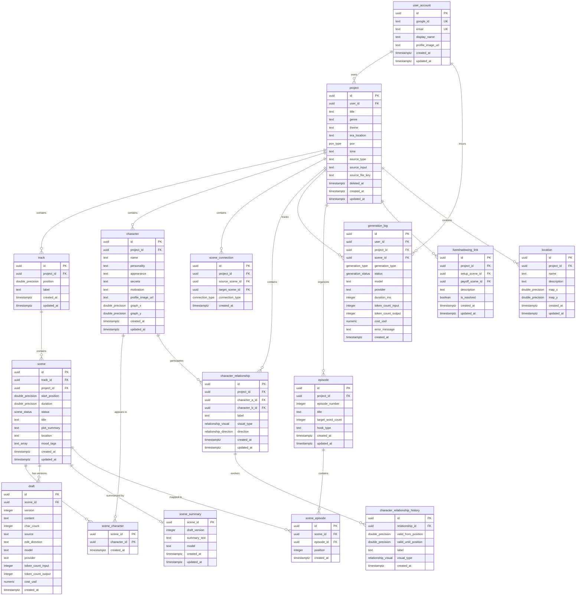

# Narrex — Database Design

**Date:** 2026-03-08
**PRD:** docs/prd.md | docs/prd-phase-1.md
**Design Doc:** docs/design-doc.md

---

## 1. Requirements Summary

### Data Sources

| Source | Key Requirements |
|---|---|
| PRD (full) | Users, projects with story config, multi-track timeline with NLE scenes, character map with relationships, episode organization, world map, foreshadowing links, AI generation with context assembly, revision tools, export |
| PRD Phase 1 | Users (Google OAuth), projects with config, multi-track timeline, scenes (CRUD, drag-and-drop, branch/merge), character map (nodes, cards, relationships), AI draft generation with context assembly, direction-based editing, generation logs |
| Design Doc | Neon PostgreSQL (us-east-1), Upstash Redis for cache, ownership-based auth (no RBAC), hexagonal architecture with SQLx, SSE streaming for generation |

### Access Patterns

| Operation | Pattern | Frequency |
|---|---|---|
| Load project workspace | Read project + tracks + scenes + characters + relationships in one request | Every session start |
| Scene context assembly | Read config + scene details + involved characters + relationships + preceding summaries + simultaneous scenes + next scene | Every AI generation |
| Scene reorder (drag-and-drop) | Update start_position of one scene | Frequent during editing |
| Draft save | Insert new draft version + update scene status | After each generation/edit |
| Generation log append | Insert-only | Every LLM API call |
| Dashboard project list | Read projects by user_id, ordered by updated_at | Every dashboard load |

### Scale Expectations

- Phase 1 beta: <100 DAU, <1000 projects, <20 scenes per project
- Growth: ~1K DAU, ~10K projects
- Write pattern: low-medium writes (scene edits, draft saves), append-only generation logs
- Read pattern: read-heavy (workspace loads, context assembly)

---

## 2. ERD



Standalone ERD file: `docs/erd.mermaid`

---

## 3. Schema Decisions & Trade-offs

### 3.1 UUID Primary Keys

**Decision:** UUID v4 (`gen_random_uuid()`) for all table PKs.

**Rationale:** IDs are exposed in API URLs (`/api/projects/{id}/scenes/{id}`). Sequential BIGINT leaks entity count and is guessable. UUID avoids this. The performance cost of random UUID v4 on B-tree indexes is acceptable at the expected scale (<100K rows per table). Neon PostgreSQL does not yet support `uuid_generate_v7()` natively.

**Trade-off:** Slightly larger indexes (16 bytes vs 8 bytes for BIGINT). Negligible at this scale.

### 3.2 NLE Timeline Model (DOUBLE PRECISION positions)

**Decision:** `scene.start_position DOUBLE PRECISION` + `scene.duration DOUBLE PRECISION DEFAULT 1.0`. Track ordering via `track.position DOUBLE PRECISION`.

**Rationale:** The NLE (Non-Linear Editing) model treats scenes as clips with extent, not point nodes. Simultaneity across tracks is determined by overlapping ranges (`start_position` to `start_position + duration`). DOUBLE PRECISION allows fractional positioning for insertion between existing scenes without renumbering (midpoint insertion: `(a + b) / 2`).

**Initial spacing:** 1024.0 between scenes. Allows ~50 insertions between any two scenes before precision concerns (~10 levels of bisection). If exhausted, a background rebalance reassigns positions with fresh spacing.

**Trade-off:** Floating-point comparison requires epsilon tolerance for exact equality checks. Range overlap queries use `>=` / `<` comparisons which work correctly with DOUBLE PRECISION.

### 3.3 Denormalized `project_id` on `scene`

**Decision:** `scene.project_id` duplicates information derivable from `scene.track_id -> track.project_id`.

**Rationale:** Context assembly queries need all scenes for a project ordered by `start_position`. Without denormalization, this requires a JOIN through `track`. The denormalized FK enables a direct index scan on `(project_id, start_position)` — the most performance-critical query in the system.

**Integrity:** Application layer ensures `scene.project_id` matches `track.project_id`. A CHECK constraint referencing another table is not possible in PostgreSQL; a trigger could enforce this but adds complexity disproportionate to the risk at this scale.

### 3.4 Draft Versioning (Separate Table)

**Decision:** Prose content lives in a `draft` table with `(scene_id, version)` versioning, not as a column on `scene`.

**Deviation from design doc:** Design doc (section 4.2, Flow 2 and Flow 3) originally referenced `scene.content` for prose storage. Updated to reflect the `draft` table approach. The design doc has been corrected.

**Rationale:**
- Preserves full edit history — users can view or revert to prior versions.
- Separates frequently-read metadata (scene title, position, status) from large text blobs (draft content), improving cache efficiency for timeline loads.
- Each draft records its source (`ai_generation`, `ai_edit`, `manual`), the model/provider used, token counts, and cost — enabling per-draft cost attribution.
- Generated column `char_count` auto-computes Korean character count (`char_length` counts Unicode characters, so one Korean syllable = 1).

**Current draft:** The latest version for a scene is `MAX(version)`. Retrieved via the descending index `idx_draft_scene_version (scene_id, version DESC)`.

### 3.5 Scene Summary (1:1 with Scene)

**Decision:** `scene_summary` uses `scene_id` as PK (1:1 relationship). Stores the compressed summary of the scene's current draft.

**Rationale:** Only one summary per scene is needed at any time — the summary of the latest confirmed draft. When a scene's content changes and a new summary is generated, it replaces the old one (UPSERT). The `draft_version` column records which draft version the summary is based on, enabling staleness detection.

**Trade-off:** Loses summary history. Acceptable — summaries are derived data, regenerable from drafts.

### 3.6 Character Relationship Pair Ordering

**Decision:** `character_a_id < character_b_id` enforced by CHECK constraint. UNIQUE on `(character_a_id, character_b_id)`.

**Rationale:** Prevents duplicate relationships (A-B and B-A). The `direction` column (`bidirectional`, `a_to_b`, `b_to_a`) captures directionality without needing two rows. Application layer must sort UUIDs before insert.

### 3.7 Soft Delete on Project Only

**Decision:** `project.deleted_at` for soft delete. All other tables use hard delete (CASCADE from parent).

**Rationale:** Projects are the user's primary work product — accidental deletion should be recoverable. Tracks, scenes, characters, etc. cascade from project deletion. Individual scene/character deletes are intentional editing actions and don't need recovery (undo is handled at the application layer).

**Query pattern:** All project queries filter `WHERE deleted_at IS NULL` via partial index.

### 3.8 Generation Log Preservation

**Decision:** `generation_log.project_id` and `generation_log.scene_id` use `ON DELETE SET NULL` (not CASCADE).

**Rationale:** Generation logs are the source of truth for AI cost monitoring (REQ-051). Deleting a project or scene must not erase cost data. The log row survives with NULLed FKs, preserving `user_id`, `model`, `token_count_*`, and `cost_usd` for billing and analytics.

### 3.9 Enum Types

**Decision:** PostgreSQL ENUMs for columns with stable, small value sets.

| Enum | Values | Rationale |
|---|---|---|
| `scene_status` | `empty`, `ai_draft`, `edited`, `needs_revision` | 4 values from PRD, unlikely to change |
| `connection_type` | `branch`, `merge` | Defined in design doc — no `sequential` (implicit from track order) |
| `relationship_visual` | `solid`, `dashed`, `arrowed` | Maps directly to PRD REQ-026 visual types |
| `relationship_direction` | `bidirectional`, `a_to_b`, `b_to_a` | 3 direction options for character pair |
| `pov_type` | `first_person`, `third_limited`, `third_omniscient` | Standard narrative POV options |
| `generation_type` | `scene`, `summary`, `structuring`, `edit` | 4 LLM use case types in Phase 1 |
| `generation_status` | `success`, `failure`, `partial` | Terminal states for a generation request |

**Trade-off:** Adding enum values is easy (`ALTER TYPE ADD VALUE`). Removing/renaming is hard (requires migration). These value sets are stable enough to justify ENUMs over lookup tables.

### 3.10 `draft.source` as CHECK Instead of ENUM

**Decision:** `source TEXT NOT NULL CHECK (source IN ('ai_generation', 'ai_edit', 'manual'))` rather than a separate ENUM type.

**Rationale:** Only used on one table. The value set may expand in Phase 2+ (e.g., `ai_variation`, `import`). CHECK constraints are easier to modify than ENUMs — a single `ALTER TABLE` vs. the multi-step ENUM migration dance.

---

## 4. Transaction Design

All operations use the default **Read Committed** isolation level. No financial operations, inventory management, or high-contention resources exist in this domain. The primary consistency concerns are atomicity of multi-table writes.

### 4.1 Project Creation with Auto-Structuring

```
BEGIN;
  INSERT INTO project (...)
  INSERT INTO track (...) -- 1-5 tracks
  INSERT INTO scene (...) -- 5-20 scenes
  INSERT INTO character (...) -- 2-10 characters
  INSERT INTO character_relationship (...) -- 1-10 relationships
  INSERT INTO scene_character (...) -- scene-character assignments
COMMIT;
```

**Atomicity:** All-or-nothing. If LLM structuring succeeds but a DB write fails, the entire project creation rolls back. The LLM call happens *before* the transaction (outside the DB lock window).

### 4.2 Draft Generation Completion

```
BEGIN;
  INSERT INTO draft (scene_id, version, content, source, model, ...)
  UPDATE scene SET status = 'ai_draft', updated_at = now() WHERE id = $scene_id
  INSERT INTO generation_log (...)
COMMIT;
-- After commit (non-transactional):
  Generate summary via LLM → UPSERT INTO scene_summary
```

**Design choice:** Summary generation is async after the draft transaction commits. The user sees the draft immediately; the summary is generated in the background for future context assembly. If summary generation fails, the draft is still saved — summaries can be retried.

### 4.3 Scene Reorder (Drag-and-Drop)

```
BEGIN;
  UPDATE scene SET start_position = $new_position, track_id = $new_track_id
  WHERE id = $scene_id
COMMIT;
```

Single-row update. No contention risk (single-user projects, no collaboration). Read Committed is sufficient.

### 4.4 Scene Deletion

```
BEGIN;
  DELETE FROM scene WHERE id = $scene_id
  -- CASCADE handles: draft, scene_summary, scene_character, scene_connection
COMMIT;
```

FK cascades handle cleanup. `generation_log.scene_id` is SET NULL (preserving cost data).

### 4.5 Config Change → Staleness Marking

When project config changes (genre, tone, etc.), scenes with existing drafts should be marked `needs_revision`:

```
BEGIN;
  UPDATE project SET genre = $new_genre, ... WHERE id = $project_id
  UPDATE scene SET status = 'needs_revision'
  WHERE project_id = $project_id AND status IN ('ai_draft', 'edited')
COMMIT;
```

**Atomicity:** Config update and staleness marking happen together. Users see the config change and stale indicators simultaneously.

---

## 5. Index Strategy

### 5.1 Primary Access Patterns and Indexes

| Query Pattern | Table | Index | Type | Notes |
|---|---|---|---|---|
| User's projects | `project` | `idx_project_user_id (user_id) WHERE deleted_at IS NULL` | B-tree, partial | Dashboard load. Filters soft-deleted. |
| Tracks in project | `track` | `idx_track_project_id (project_id, position)` | B-tree, composite | Ordered track listing. |
| Scenes in project (context assembly) | `scene` | `idx_scene_project_position (project_id, start_position)` | B-tree, composite | Most critical query. All scenes ordered by timeline position. |
| Scenes in track | `scene` | `idx_scene_track_position (track_id, start_position)` | B-tree, composite | Per-track scene listing for timeline rendering. |
| Scene mood tags | `scene` | `idx_scene_mood_tags USING GIN (mood_tags)` | GIN | Array containment queries for mood filtering. |
| Characters in project | `character` | `idx_character_project_id (project_id)` | B-tree | Character map load. |
| Characters in scene | `scene_character` | PK `(scene_id, character_id)` + `idx_scene_character_character (character_id)` | B-tree | Bidirectional lookup: scenes-for-character and characters-for-scene. |
| Relationships in project | `character_relationship` | `idx_relationship_project (project_id)` | B-tree | Relationship map load. |
| Relationships for character | `character_relationship` | `idx_relationship_char_a (character_a_id)` + `idx_relationship_char_b (character_b_id)` | B-tree | Find all relationships involving a character. |
| Latest draft for scene | `draft` | `idx_draft_scene_version (scene_id, version DESC)` | B-tree, composite | Descending for "latest first" access. |
| Connections for scene | `scene_connection` | `idx_scene_connection_source (source_scene_id)` + `idx_scene_connection_target (target_scene_id)` | B-tree | Branch/merge point traversal. |
| User generation history | `generation_log` | `idx_genlog_user_created (user_id, created_at DESC)` | B-tree, composite | Per-user cost/usage dashboard. |
| Project generation history | `generation_log` | `idx_genlog_project_created (project_id, created_at DESC) WHERE project_id IS NOT NULL` | B-tree, partial | Per-project cost view. Partial excludes orphaned logs. |
| Time-range log queries | `generation_log` | `idx_genlog_created_at USING BRIN (created_at)` | BRIN | Append-only table, physically ordered by insertion time. BRIN is 100x smaller than B-tree for time-series. |

### 5.2 FK Indexes

PostgreSQL does not auto-index FK columns. All FK columns have explicit indexes (listed above). This prevents sequential scans on CASCADE deletes and JOIN operations.

### 5.3 Indexes NOT Created (and why)

| Column | Why No Index |
|---|---|
| `project.deleted_at` | Covered by partial index on `user_id`. No standalone query on `deleted_at`. |
| `scene.status` | Low selectivity (4 values). Filtered in application after loading all project scenes. |
| `draft.source` | Low selectivity (3 values). Never queried standalone. |
| `generation_log.model` | Analytics query, not latency-sensitive. Sequential scan acceptable on log table. |
| `character.name` | Searched within a project (small set). No cross-project character search. |

---

## 6. Performance Notes

### 6.1 Context Assembly Query

The most performance-critical operation. Assembles AI prompt context for scene generation:

```sql
-- 1. Global config
SELECT genre, theme, era_location, pov, tone FROM project WHERE id = $project_id;

-- 2. Current scene + involved characters
SELECT s.*, array_agg(sc.character_id) AS character_ids
FROM scene s
LEFT JOIN scene_character sc ON sc.scene_id = s.id
WHERE s.id = $scene_id
GROUP BY s.id;

-- 3. Character cards + relationships for involved characters
SELECT * FROM character WHERE id = ANY($character_ids);

SELECT * FROM character_relationship
WHERE project_id = $project_id
  AND (character_a_id = ANY($character_ids) OR character_b_id = ANY($character_ids));

-- 4. Preceding scene summaries (ordered by position)
SELECT ss.summary_text, s.title, s.start_position
FROM scene_summary ss
JOIN scene s ON s.id = ss.scene_id
WHERE s.project_id = $project_id
  AND s.start_position < $current_start_position
ORDER BY s.start_position;

-- 5. Simultaneous scenes (overlapping ranges on other tracks)
SELECT s.title, s.plot_summary
FROM scene s
WHERE s.project_id = $project_id
  AND s.track_id != $current_track_id
  AND s.start_position < ($current_start_position + $current_duration)
  AND (s.start_position + s.duration) > $current_start_position;

-- 6. Next scene
SELECT title, plot_summary FROM scene
WHERE project_id = $project_id AND start_position > $current_start_position
ORDER BY start_position LIMIT 1;
```

All queries hit indexed paths. At <20 scenes per project, each query returns in <1ms on Neon.

### 6.2 Workspace Load

Single request loads the full workspace. Can be parallelized in the API:

```
parallel {
  SELECT * FROM track WHERE project_id = $id ORDER BY position;
  SELECT * FROM scene WHERE project_id = $id ORDER BY start_position;
  SELECT * FROM character WHERE project_id = $id;
  SELECT * FROM character_relationship WHERE project_id = $id;
  SELECT * FROM scene_character WHERE scene_id = ANY($scene_ids);
  SELECT * FROM scene_connection WHERE project_id = $id;
}
```

At Phase 1 scale (~20 scenes, ~10 characters), total payload is <50KB. Single round-trip is also viable.

### 6.3 Neon Cold Start

Neon free tier auto-suspends after 5 minutes of inactivity. First request after suspend incurs ~1-2s latency. Acceptable for Phase 1 beta. Mitigation: upgrade to Scale plan with configurable suspend timeout when latency matters.

### 6.4 Connection Pooling

Neon provides built-in connection pooling via their serverless driver. Cloud Run instances use a connection pool per container (SQLx pool, max 5 connections per instance). At 0-10 Cloud Run instances, max 50 connections — well within Neon limits.

---

## 7. Migration Plan

### 7.1 Migration Strategy

- Version-controlled SQL files in `db/migrations/`.
- Naming: `NNN_description.sql` + `NNN_description.rollback.sql`.
- Applied via SQLx CLI (`sqlx migrate run`) or custom script.
- Each migration is idempotent where possible (`IF NOT EXISTS`).
- Rollback scripts are mandatory for every migration.

### 7.2 Phase 1 Migration

File: `db/migrations/001_initial_schema.sql`

Includes all Phase 1 tables:
- `user_account`, `project`, `track`, `scene`, `scene_connection`
- `character`, `scene_character`, `character_relationship`
- `draft`, `scene_summary`, `generation_log`
- All enum types, indexes, triggers, and constraints

Rollback: `db/migrations/001_initial_schema.rollback.sql` — drops all tables, functions, types, and extensions in reverse dependency order.

### 7.3 Future Phase Migrations

| Migration | Phase | Content |
|---|---|---|
| `002_episode_layer.sql` | Phase 2 | `episode`, `scene_episode` tables. Add `hook_type` column. |
| `003_foreshadowing.sql` | Phase 2 | `foreshadowing_link` table. |
| `004_world_map.sql` | Phase 3 | `location` table. Add `location_id FK` to `scene`. |
| `005_temporal_relationships.sql` | Phase 3 | `character_relationship_history` table. |

---

## 8. Phase 2+ Table Designs

These tables are documented here for planning but are NOT included in `001_initial_schema.sql`.

### 8.1 Episode Organization [Phase 2]

```sql
CREATE TABLE episode (
    id                UUID        DEFAULT gen_random_uuid() PRIMARY KEY,
    project_id        UUID        NOT NULL REFERENCES project(id) ON DELETE CASCADE,
    created_at        TIMESTAMPTZ NOT NULL DEFAULT now(),
    updated_at        TIMESTAMPTZ NOT NULL DEFAULT now(),
    episode_number    INTEGER     NOT NULL,
    title             TEXT,
    target_word_count INTEGER     DEFAULT 4000,
    hook_type         TEXT,
    CONSTRAINT uq_episode_number UNIQUE (project_id, episode_number),
    CONSTRAINT chk_episode_number CHECK (episode_number > 0),
    CONSTRAINT chk_episode_target_wc CHECK (target_word_count BETWEEN 500 AND 20000),
    CONSTRAINT chk_episode_title_length CHECK (char_length(title) <= 300)
);

CREATE INDEX idx_episode_project ON episode (project_id, episode_number);

-- Many-to-many: scenes can span episodes, episodes contain multiple scenes
CREATE TABLE scene_episode (
    id          UUID        DEFAULT gen_random_uuid() PRIMARY KEY,
    scene_id    UUID        NOT NULL REFERENCES scene(id) ON DELETE CASCADE,
    episode_id  UUID        NOT NULL REFERENCES episode(id) ON DELETE CASCADE,
    position    INTEGER     NOT NULL,
    created_at  TIMESTAMPTZ NOT NULL DEFAULT now(),
    CONSTRAINT uq_scene_episode UNIQUE (scene_id, episode_id),
    CONSTRAINT uq_episode_position UNIQUE (episode_id, position)
);

CREATE INDEX idx_scene_episode_scene ON scene_episode (scene_id);
CREATE INDEX idx_scene_episode_episode ON scene_episode (episode_id, position);
```

### 8.2 Foreshadowing Links [Phase 2]

```sql
CREATE TABLE foreshadowing_link (
    id              UUID        DEFAULT gen_random_uuid() PRIMARY KEY,
    project_id      UUID        NOT NULL REFERENCES project(id) ON DELETE CASCADE,
    setup_scene_id  UUID        NOT NULL REFERENCES scene(id) ON DELETE CASCADE,
    payoff_scene_id UUID        REFERENCES scene(id) ON DELETE SET NULL,
    created_at      TIMESTAMPTZ NOT NULL DEFAULT now(),
    updated_at      TIMESTAMPTZ NOT NULL DEFAULT now(),
    description     TEXT,
    is_resolved     BOOLEAN     NOT NULL DEFAULT false,
    CONSTRAINT chk_different_scenes CHECK (setup_scene_id != payoff_scene_id),
    CONSTRAINT chk_foreshadowing_desc_length CHECK (char_length(description) <= 1000)
);

CREATE INDEX idx_foreshadowing_project ON foreshadowing_link (project_id);
CREATE INDEX idx_foreshadowing_setup ON foreshadowing_link (setup_scene_id);
CREATE INDEX idx_foreshadowing_unresolved ON foreshadowing_link (project_id)
    WHERE is_resolved = false;
```

### 8.3 World Map / Locations [Phase 3]

```sql
CREATE TABLE location (
    id          UUID             DEFAULT gen_random_uuid() PRIMARY KEY,
    project_id  UUID             NOT NULL REFERENCES project(id) ON DELETE CASCADE,
    created_at  TIMESTAMPTZ      NOT NULL DEFAULT now(),
    updated_at  TIMESTAMPTZ      NOT NULL DEFAULT now(),
    name        TEXT             NOT NULL,
    description TEXT,
    map_x       DOUBLE PRECISION,
    map_y       DOUBLE PRECISION,
    CONSTRAINT chk_location_name_length CHECK (char_length(name) <= 200),
    CONSTRAINT chk_location_desc_length CHECK (char_length(description) <= 2000)
);

CREATE INDEX idx_location_project ON location (project_id);

-- Phase 3 migration also adds FK to scene:
-- ALTER TABLE scene ADD COLUMN location_id UUID REFERENCES location(id) ON DELETE SET NULL;
-- CREATE INDEX idx_scene_location ON scene (location_id) WHERE location_id IS NOT NULL;
```

### 8.4 Temporal Character Relationships [Phase 3]

```sql
CREATE TABLE character_relationship_history (
    id                  UUID                DEFAULT gen_random_uuid() PRIMARY KEY,
    relationship_id     UUID                NOT NULL REFERENCES character_relationship(id) ON DELETE CASCADE,
    created_at          TIMESTAMPTZ         NOT NULL DEFAULT now(),
    valid_from_position DOUBLE PRECISION    NOT NULL,
    valid_until_position DOUBLE PRECISION,
    label               TEXT                NOT NULL,
    visual_type         relationship_visual NOT NULL,
    CONSTRAINT chk_valid_range CHECK (
        valid_until_position IS NULL OR valid_until_position > valid_from_position
    ),
    CONSTRAINT chk_history_label_length CHECK (char_length(label) <= 200)
);

CREATE INDEX idx_rel_history_relationship ON character_relationship_history (relationship_id, valid_from_position);
```

---

## 9. Phase Implementation Summary

### Phase 1

**Tables:** `user_account`, `project`, `track`, `scene`, `scene_connection`, `character`, `scene_character`, `character_relationship`, `draft`, `scene_summary`, `generation_log`

**Enum types:** `scene_status`, `connection_type`, `relationship_visual`, `relationship_direction`, `pov_type`, `generation_type`, `generation_status`

**Key indexes:**
- `idx_scene_project_position` — context assembly (most critical)
- `idx_draft_scene_version` — latest draft retrieval
- `idx_genlog_user_created` — per-user cost monitoring
- `idx_project_user_id` (partial) — dashboard project list

**Migration:** `db/migrations/001_initial_schema.sql`

### Phase 2

**New tables:** `episode`, `scene_episode`, `foreshadowing_link`

**Schema changes to existing tables:**
- `scene`: add `episode_hook_type TEXT` (episode-end classification after generation)
- `scene`: add `expected_word_count INTEGER` (per-scene target word count, from PRD REQ-014 deferred fields)

### Phase 3+

**New tables:** `location`, `character_relationship_history`

**Schema changes to existing tables:**
- `scene`: add `location_id UUID REFERENCES location(id)` (replaces free-text `location` field)
- `character_relationship`: current row becomes the "latest state"; history rows track temporal evolution
