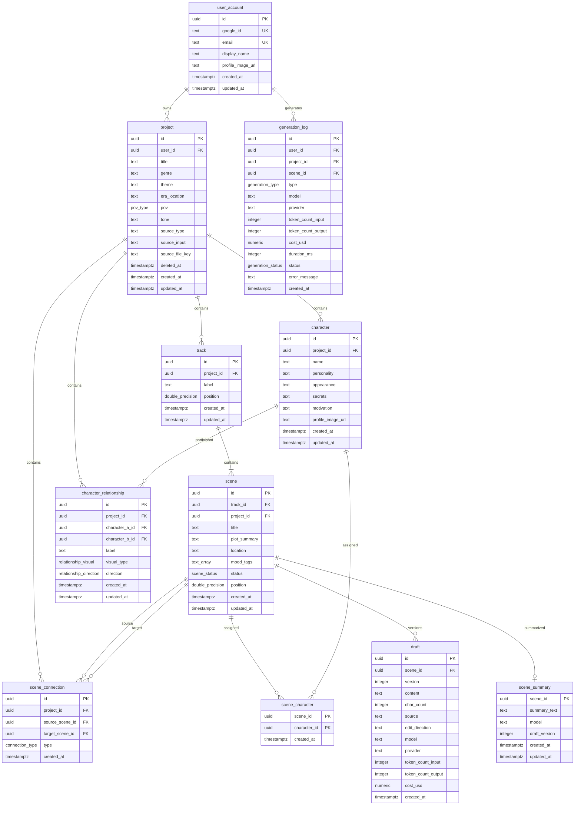

# Narrex — Database Design

**Status:** Draft
**Author:** zzoo
**Date:** 2026-03-07
**PRD Reference:** docs/prd.md, docs/prd-phase-1.md
**Design Doc Reference:** docs/design-doc.md

---

## 1. Overview

### 1.1 Storage Architecture

From the design doc (Section 4.2):

| Store | Data | Consistency |
|-------|------|-------------|
| **Neon (PostgreSQL)** | Projects, scenes, tracks, connections, characters, relationships, drafts, summaries, users | Strong (ACID) |
| **Upstash Redis** | Prompt context cache, rate limits, refresh token blocklist | Eventual (TTL) |
| **Cloudflare R2** | Imported files, character images, exported manuscripts | Eventual |

This document covers the PostgreSQL schema only. Redis and R2 are documented in the design doc.

### 1.2 Design Principles

1. **Normalize to 3NF, denormalize with intent.** All tables are at least 3NF. The only intentional denormalization is `scene.project_id` (derivable via `track.project_id`) — justified because context assembly, authorization checks, and project-level queries would otherwise require a join through `track` on every request.

2. **UUIDs for all primary keys.** Externally safe (no enumeration), distributed-friendly. Uses `gen_random_uuid()` (UUID v4, built-in since PG 13). Performance impact is negligible at expected scale (<1M rows).

3. **Fractional ordering for drag-and-drop.** `position` columns use `DOUBLE PRECISION` with initial spacing of 1024.0. Insertions use midpoints. Renormalize when gaps fall below 0.001. This avoids renumbering all siblings on every reorder.

4. **Soft delete for projects only.** Projects use `deleted_at TIMESTAMPTZ` — users may want to recover. Scenes, tracks, characters use hard delete with `ON DELETE CASCADE` from project. Generation logs use `ON DELETE SET NULL` for scene/project FKs to preserve cost data.

5. **ENUM for stable value sets.** Scene status, connection types, relationship types — these have 3-5 values defined in the PRD with no indication of change. Adding values is easy (`ALTER TYPE ... ADD VALUE`); if a domain needs frequent value changes, migrate to a lookup table.

6. **TIMESTAMPTZ everywhere.** All timestamps are timezone-aware UTC.

7. **TEXT over VARCHAR.** No performance difference in PostgreSQL. Length limits enforced via CHECK constraints where needed.

### 1.3 Naming Convention

```
Tables:       snake_case, singular (user_account, scene, character)
Columns:      snake_case, no table prefix (name, NOT character_name)
PK:           id (UUID)
FK:           referenced_table_id (user_id, project_id, track_id)
Indexes:      idx_{table}_{columns}
Constraints:  {type}_{table}_{columns} (uq_, chk_)
Enums:        snake_case (scene_status, connection_type)
Triggers:     trg_{table}_{event}
```

### 1.4 Design Doc Deviations

| Topic | Design Doc Implies | Database Design Decision | Reason |
|-------|-------------------|-------------------------|--------|
| Scene position | Not specified | `DOUBLE PRECISION` fractional ordering | Avoids O(n) renumbering on drag-and-drop. Standard pattern (Figma, Linear). |
| Draft storage | "Store full draft text in DB" | Versioned `draft` table (all versions kept) | PRD requires undo for direction-based edits. Version history enables this without application-level undo stacks. |
| Scene summary | "1:1 with scene" | `scene_summary` with `scene_id` as PK | Eliminates redundant surrogate key. One summary per scene, replaced on update. |
| Character table name | N/A | `character` (unquoted) | Non-reserved in PostgreSQL (can be used as identifier). Works with SQLx compile-time queries. |

---

## 2. Entity-Relationship Diagram



*Standalone file: [docs/erd.mermaid](./erd.mermaid)*

---

## 3. Schema Design

### 3.1 Enum Types

```sql
-- Scene lifecycle states (REQ-015)
CREATE TYPE scene_status AS ENUM ('empty', 'ai_draft', 'edited', 'needs_revision');

-- Narrative flow between scenes (REQ-012)
CREATE TYPE connection_type AS ENUM ('sequential', 'branch', 'merge');

-- Character relationship appearance (REQ-026)
CREATE TYPE relationship_visual AS ENUM ('solid', 'dashed', 'arrowed');

-- Character relationship directionality (REQ-026)
CREATE TYPE relationship_direction AS ENUM ('bidirectional', 'a_to_b', 'b_to_a');

-- Story point of view (REQ-007)
CREATE TYPE pov_type AS ENUM ('first_person', 'third_limited', 'third_omniscient');

-- AI generation task types (REQ-051)
CREATE TYPE generation_type AS ENUM ('scene', 'summary', 'structuring', 'edit');

-- AI generation outcome
CREATE TYPE generation_status AS ENUM ('success', 'failure', 'partial');
```

**Why ENUM over lookup table:** These value sets are defined in the PRD with 3-7 values each and no indication they'll change frequently. ENUMs provide type safety, smaller storage (4 bytes), and simpler queries. If Phase 2+ requirements demand dynamic values, migrate to a lookup table using the expand-contract pattern.

### 3.2 Shared Infrastructure

```sql
-- Auto-update updated_at on every UPDATE
CREATE OR REPLACE FUNCTION fn_set_updated_at()
RETURNS TRIGGER AS $$
BEGIN
    NEW.updated_at = now();
    RETURN NEW;
END;
$$ LANGUAGE plpgsql;
```

### 3.3 Tables

#### user_account [Phase 1]

Google OAuth2 users. Ownership-based authorization — all queries filter by `user_id`.

```sql
CREATE TABLE user_account (
    id              UUID        DEFAULT gen_random_uuid() PRIMARY KEY,
    created_at      TIMESTAMPTZ NOT NULL DEFAULT now(),
    updated_at      TIMESTAMPTZ NOT NULL DEFAULT now(),
    google_id       TEXT        NOT NULL,
    email           TEXT        NOT NULL,
    display_name    TEXT,
    profile_image_url TEXT,
    CONSTRAINT uq_user_google_id UNIQUE (google_id),
    CONSTRAINT uq_user_email UNIQUE (email),
    CONSTRAINT chk_user_email_length CHECK (char_length(email) <= 255)
);

CREATE TRIGGER trg_user_account_updated_at
    BEFORE UPDATE ON user_account
    FOR EACH ROW EXECUTE FUNCTION fn_set_updated_at();
```

#### project [Phase 1]

A story workspace. Contains global config settings that shape all AI generation (REQ-007, REQ-008). Soft-deleted via `deleted_at`.

```sql
CREATE TABLE project (
    id              UUID        DEFAULT gen_random_uuid() PRIMARY KEY,
    user_id         UUID        NOT NULL REFERENCES user_account(id) ON DELETE CASCADE,
    created_at      TIMESTAMPTZ NOT NULL DEFAULT now(),
    updated_at      TIMESTAMPTZ NOT NULL DEFAULT now(),
    deleted_at      TIMESTAMPTZ,
    title           TEXT        NOT NULL,
    genre           TEXT,
    theme           TEXT,
    era_location    TEXT,
    pov             pov_type,
    tone            TEXT,
    source_type     TEXT        CHECK (source_type IN ('free_text', 'file_import', 'template')),
    source_input    TEXT,
    source_file_key TEXT,
    CONSTRAINT chk_project_title_length CHECK (char_length(title) <= 200)
);

COMMENT ON COLUMN project.source_input IS 'Original user text input or extracted text from imported file';
COMMENT ON COLUMN project.source_file_key IS 'Cloudflare R2 object key for imported file';

CREATE INDEX idx_project_user_id ON project (user_id) WHERE deleted_at IS NULL;

CREATE TRIGGER trg_project_updated_at
    BEFORE UPDATE ON project
    FOR EACH ROW EXECUTE FUNCTION fn_set_updated_at();
```

**Config as columns vs JSONB:** Config fields (genre, theme, era_location, pov, tone) are proper columns because: (a) they're used in every AI generation prompt — type safety matters; (b) the set is well-defined in the PRD; (c) they need individual indexing for analytics (e.g., "how many projects use regression genre?"). If Phase 2+ adds many dynamic config fields, use a `config_extra JSONB` column rather than converting existing columns.

#### track [Phase 1]

Parallel storylines within a project (REQ-011). Each track represents an independent narrative thread.

```sql
CREATE TABLE track (
    id              UUID             DEFAULT gen_random_uuid() PRIMARY KEY,
    project_id      UUID             NOT NULL REFERENCES project(id) ON DELETE CASCADE,
    created_at      TIMESTAMPTZ      NOT NULL DEFAULT now(),
    updated_at      TIMESTAMPTZ      NOT NULL DEFAULT now(),
    position        DOUBLE PRECISION NOT NULL,
    label           TEXT,
    CONSTRAINT chk_track_position CHECK (position > 0)
);

CREATE INDEX idx_track_project_id ON track (project_id, position);

CREATE TRIGGER trg_track_updated_at
    BEFORE UPDATE ON track
    FOR EACH ROW EXECUTE FUNCTION fn_set_updated_at();
```

#### scene [Phase 1]

Scene on the timeline (REQ-009, REQ-014, REQ-015). The central entity — scenes connect to characters, drafts, summaries, and other scenes.

```sql
CREATE TABLE scene (
    id              UUID             DEFAULT gen_random_uuid() PRIMARY KEY,
    track_id        UUID             NOT NULL REFERENCES track(id) ON DELETE CASCADE,
    project_id      UUID             NOT NULL REFERENCES project(id) ON DELETE CASCADE,
    created_at      TIMESTAMPTZ      NOT NULL DEFAULT now(),
    updated_at      TIMESTAMPTZ      NOT NULL DEFAULT now(),
    position        DOUBLE PRECISION NOT NULL,
    status          scene_status     NOT NULL DEFAULT 'empty',
    title           TEXT             NOT NULL,
    plot_summary    TEXT,
    location        TEXT,
    mood_tags       TEXT[]           DEFAULT '{}',
    CONSTRAINT chk_scene_position CHECK (position > 0),
    CONSTRAINT chk_scene_title_length CHECK (char_length(title) <= 500)
);

COMMENT ON COLUMN scene.project_id IS 'Denormalized from track.project_id for query performance';
COMMENT ON COLUMN scene.position IS 'Fractional ordering. Initial spacing: 1024.0. Insert at midpoint.';
COMMENT ON COLUMN scene.mood_tags IS 'Override config-level tone for this scene';

CREATE INDEX idx_scene_project_position ON scene (project_id, position);
CREATE INDEX idx_scene_track_position ON scene (track_id, position);
CREATE INDEX idx_scene_mood_tags ON scene USING GIN (mood_tags);

CREATE TRIGGER trg_scene_updated_at
    BEFORE UPDATE ON scene
    FOR EACH ROW EXECUTE FUNCTION fn_set_updated_at();
```

**Why `project_id` on scene (denormalization):** Every context assembly query, authorization check, and project-level listing needs the project. Without `project_id`, these require `JOIN track ON track.id = scene.track_id` on every query. At Phase 1 scale this is fine performance-wise, but adding the FK is zero-cost on writes (set once, never changes) and eliminates a join on every read. The FK constraint to `project` ensures consistency.

#### scene_connection [Phase 1]

Narrative flow between scenes — sequential, branch, and merge points (REQ-012).

```sql
CREATE TABLE scene_connection (
    id              UUID            DEFAULT gen_random_uuid() PRIMARY KEY,
    project_id      UUID            NOT NULL REFERENCES project(id) ON DELETE CASCADE,
    source_scene_id UUID            NOT NULL REFERENCES scene(id) ON DELETE CASCADE,
    target_scene_id UUID            NOT NULL REFERENCES scene(id) ON DELETE CASCADE,
    created_at      TIMESTAMPTZ     NOT NULL DEFAULT now(),
    connection_type connection_type  NOT NULL DEFAULT 'sequential',
    CONSTRAINT chk_no_self_connection CHECK (source_scene_id != target_scene_id),
    CONSTRAINT uq_scene_connection UNIQUE (source_scene_id, target_scene_id)
);

CREATE INDEX idx_scene_connection_source ON scene_connection (source_scene_id);
CREATE INDEX idx_scene_connection_target ON scene_connection (target_scene_id);
CREATE INDEX idx_scene_connection_project ON scene_connection (project_id);
```

#### character [Phase 1]

Story characters with rich attributes used as AI generation context (REQ-024, REQ-025).

```sql
CREATE TABLE character (
    id                UUID        DEFAULT gen_random_uuid() PRIMARY KEY,
    project_id        UUID        NOT NULL REFERENCES project(id) ON DELETE CASCADE,
    created_at        TIMESTAMPTZ NOT NULL DEFAULT now(),
    updated_at        TIMESTAMPTZ NOT NULL DEFAULT now(),
    name              TEXT        NOT NULL,
    personality       TEXT,
    appearance        TEXT,
    secrets           TEXT,
    motivation        TEXT,
    profile_image_url TEXT,
    CONSTRAINT chk_character_name_length CHECK (char_length(name) <= 200)
);

CREATE INDEX idx_character_project_id ON character (project_id);

CREATE TRIGGER trg_character_updated_at
    BEFORE UPDATE ON character
    FOR EACH ROW EXECUTE FUNCTION fn_set_updated_at();
```

#### scene_character [Phase 1]

Many-to-many: which characters appear in which scenes (REQ-014). Used by context assembly to select relevant character data for AI prompts.

```sql
CREATE TABLE scene_character (
    scene_id     UUID        NOT NULL REFERENCES scene(id) ON DELETE CASCADE,
    character_id UUID        NOT NULL REFERENCES character(id) ON DELETE CASCADE,
    created_at   TIMESTAMPTZ NOT NULL DEFAULT now(),
    PRIMARY KEY (scene_id, character_id)
);

CREATE INDEX idx_scene_character_character ON scene_character (character_id);
```

#### character_relationship [Phase 1]

Relationships between characters — visual type and label included in AI context (REQ-026).

```sql
CREATE TABLE character_relationship (
    id              UUID                   DEFAULT gen_random_uuid() PRIMARY KEY,
    project_id      UUID                   NOT NULL REFERENCES project(id) ON DELETE CASCADE,
    character_a_id  UUID                   NOT NULL REFERENCES character(id) ON DELETE CASCADE,
    character_b_id  UUID                   NOT NULL REFERENCES character(id) ON DELETE CASCADE,
    created_at      TIMESTAMPTZ            NOT NULL DEFAULT now(),
    updated_at      TIMESTAMPTZ            NOT NULL DEFAULT now(),
    label           TEXT                   NOT NULL,
    visual_type     relationship_visual    NOT NULL DEFAULT 'solid',
    direction       relationship_direction NOT NULL DEFAULT 'bidirectional',
    CONSTRAINT chk_different_characters CHECK (character_a_id != character_b_id),
    CONSTRAINT uq_character_pair UNIQUE (character_a_id, character_b_id)
);

COMMENT ON COLUMN character_relationship.character_a_id IS 'Convention: character_a_id < character_b_id (lexicographic UUID) to prevent duplicate pairs';
COMMENT ON COLUMN character_relationship.direction IS 'a_to_b: A->B only. b_to_a: B->A only. bidirectional: both.';

CREATE INDEX idx_relationship_project ON character_relationship (project_id);
CREATE INDEX idx_relationship_char_a ON character_relationship (character_a_id);
CREATE INDEX idx_relationship_char_b ON character_relationship (character_b_id);

CREATE TRIGGER trg_relationship_updated_at
    BEFORE UPDATE ON character_relationship
    FOR EACH ROW EXECUTE FUNCTION fn_set_updated_at();
```

**Preventing duplicate pairs:** The UNIQUE constraint on `(character_a_id, character_b_id)` prevents A→B and A→B duplicates. To also prevent B→A duplicates (since a relationship between A and B is the same regardless of order), the application layer should enforce `character_a_id < character_b_id` (lexicographic UUID comparison) before insert. A CHECK constraint cannot reference other rows, so this is enforced in application code.

#### draft [Phase 1]

Versioned prose content for scenes. Each AI generation, direction-based edit, or manual save creates a new version. The latest version is the current draft.

```sql
CREATE TABLE draft (
    id                UUID        DEFAULT gen_random_uuid() PRIMARY KEY,
    scene_id          UUID        NOT NULL REFERENCES scene(id) ON DELETE CASCADE,
    created_at        TIMESTAMPTZ NOT NULL DEFAULT now(),
    version           INTEGER     NOT NULL,
    token_count_input INTEGER,
    token_count_output INTEGER,
    content           TEXT        NOT NULL,
    char_count        INTEGER     GENERATED ALWAYS AS (char_length(content)) STORED,
    source            TEXT        NOT NULL CHECK (source IN ('ai_generation', 'ai_edit', 'manual')),
    edit_direction    TEXT,
    model             TEXT,
    provider          TEXT,
    cost_usd          NUMERIC(10, 6),
    CONSTRAINT uq_draft_scene_version UNIQUE (scene_id, version)
);

COMMENT ON COLUMN draft.char_count IS 'Auto-computed Korean character count (char_length counts Unicode characters)';
COMMENT ON COLUMN draft.edit_direction IS 'User instruction for direction-based edits, e.g. "more tension"';
COMMENT ON COLUMN draft.version IS 'Monotonically increasing per scene. Latest version = current draft.';

CREATE INDEX idx_draft_scene_version ON draft (scene_id, version DESC);
```

**Why versioned rows instead of mutable draft:** The PRD requires undo for direction-based edits (REQ-043). Storing each version as a separate row provides: (a) natural undo via previous version lookup; (b) edit history for analytics (text retention rate); (c) no lost data from overwrites. The current draft is always `ORDER BY version DESC LIMIT 1`.

**`char_count` generated column:** `char_length()` counts Unicode characters, which matches the Korean web novel standard of "글자 수" (character count). Each Korean syllable block (e.g., 한) is one character. Stored for efficient aggregation queries (total character count per project) without loading TEXT content.

#### scene_summary [Phase 1]

Compressed AI summary of a scene's draft, used as context for generating subsequent scenes (REQ-035, design doc Section 10.4).

```sql
CREATE TABLE scene_summary (
    scene_id      UUID        PRIMARY KEY REFERENCES scene(id) ON DELETE CASCADE,
    created_at    TIMESTAMPTZ NOT NULL DEFAULT now(),
    updated_at    TIMESTAMPTZ NOT NULL DEFAULT now(),
    draft_version INTEGER     NOT NULL,
    summary_text  TEXT        NOT NULL,
    model         TEXT,
    CONSTRAINT chk_summary_length CHECK (char_length(summary_text) <= 2000)
);

COMMENT ON COLUMN scene_summary.draft_version IS 'Which draft version this summary is based on. Stale if < current draft version.';

CREATE TRIGGER trg_scene_summary_updated_at
    BEFORE UPDATE ON scene_summary
    FOR EACH ROW EXECUTE FUNCTION fn_set_updated_at();
```

**PK is `scene_id`:** One summary per scene. No surrogate key needed. INSERT ON CONFLICT DO UPDATE for upsert pattern.

#### generation_log [Phase 1]

Every LLM API call logged for cost monitoring and analytics (REQ-051, design doc Section 10.7). Append-only.

```sql
CREATE TABLE generation_log (
    id                UUID              DEFAULT gen_random_uuid() PRIMARY KEY,
    user_id           UUID              NOT NULL REFERENCES user_account(id) ON DELETE CASCADE,
    project_id        UUID              REFERENCES project(id) ON DELETE SET NULL,
    scene_id          UUID              REFERENCES scene(id) ON DELETE SET NULL,
    created_at        TIMESTAMPTZ       NOT NULL DEFAULT now(),
    duration_ms       INTEGER           NOT NULL,
    token_count_input INTEGER           NOT NULL,
    token_count_output INTEGER          NOT NULL,
    generation_type   generation_type   NOT NULL,
    status            generation_status NOT NULL,
    model             TEXT              NOT NULL,
    provider          TEXT              NOT NULL,
    cost_usd          NUMERIC(10, 6)    NOT NULL,
    error_message     TEXT
);

COMMENT ON COLUMN generation_log.project_id IS 'SET NULL on project delete to preserve cost data';
COMMENT ON COLUMN generation_log.scene_id IS 'SET NULL on scene delete to preserve cost data';

CREATE INDEX idx_genlog_user_created ON generation_log (user_id, created_at DESC);
CREATE INDEX idx_genlog_project_created ON generation_log (project_id, created_at DESC)
    WHERE project_id IS NOT NULL;
CREATE INDEX idx_genlog_created_at ON generation_log USING BRIN (created_at);
```

**BRIN index on `created_at`:** Generation logs are append-only and physically ordered by insertion time. BRIN is ~100x smaller than B-tree for time-ordered data. Supports range queries for cost aggregation reports.

**`ON DELETE SET NULL` for project_id and scene_id:** Preserves generation cost data even when scenes are deleted or projects are hard-deleted. User deletion cascades everything (GDPR-compatible).

---

## 4. Index Strategy

### 4.1 Index Summary

| Table | Index | Type | Columns | Rationale |
|-------|-------|------|---------|-----------|
| user_account | uq_user_google_id | UNIQUE (B-tree) | google_id | OAuth login lookup |
| user_account | uq_user_email | UNIQUE (B-tree) | email | Email uniqueness |
| project | idx_project_user_id | B-tree (partial) | user_id WHERE deleted_at IS NULL | Dashboard: list user's active projects |
| track | idx_track_project_id | B-tree | (project_id, position) | Ordered tracks for a project |
| scene | idx_scene_project_position | B-tree | (project_id, position) | All scenes in a project, ordered |
| scene | idx_scene_track_position | B-tree | (track_id, position) | Scenes within a track, ordered |
| scene | idx_scene_mood_tags | GIN | mood_tags | Tag-based filtering |
| scene_connection | idx_scene_connection_source | B-tree | source_scene_id | Outgoing connections from a scene |
| scene_connection | idx_scene_connection_target | B-tree | target_scene_id | Incoming connections to a scene |
| scene_connection | idx_scene_connection_project | B-tree | project_id | All connections in a project |
| character | idx_character_project_id | B-tree | project_id | All characters in a project |
| scene_character | (PK) | B-tree | (scene_id, character_id) | Characters for a scene |
| scene_character | idx_scene_character_character | B-tree | character_id | Scenes containing a character |
| character_relationship | idx_relationship_project | B-tree | project_id | All relationships in a project |
| character_relationship | idx_relationship_char_a | B-tree | character_a_id | Relationships for a character |
| character_relationship | idx_relationship_char_b | B-tree | character_b_id | Relationships for a character |
| draft | idx_draft_scene_version | B-tree | (scene_id, version DESC) | Current draft lookup (LIMIT 1) |
| generation_log | idx_genlog_user_created | B-tree | (user_id, created_at DESC) | Per-user cost dashboard |
| generation_log | idx_genlog_project_created | B-tree (partial) | (project_id, created_at DESC) WHERE project_id IS NOT NULL | Per-project cost |
| generation_log | idx_genlog_created_at | BRIN | created_at | Time-range cost aggregation |

### 4.2 FK Index Coverage

PostgreSQL does NOT auto-create indexes on FK columns. Every FK in this schema has a corresponding index:

| FK Column | Covered By |
|-----------|-----------|
| project.user_id | idx_project_user_id |
| track.project_id | idx_track_project_id |
| scene.track_id | idx_scene_track_position |
| scene.project_id | idx_scene_project_position |
| scene_connection.source_scene_id | idx_scene_connection_source |
| scene_connection.target_scene_id | idx_scene_connection_target |
| scene_connection.project_id | idx_scene_connection_project |
| character.project_id | idx_character_project_id |
| scene_character.scene_id | PK (scene_id, character_id) |
| scene_character.character_id | idx_scene_character_character |
| character_relationship.project_id | idx_relationship_project |
| character_relationship.character_a_id | idx_relationship_char_a |
| character_relationship.character_b_id | idx_relationship_char_b |
| draft.scene_id | idx_draft_scene_version |
| scene_summary.scene_id | PK |
| generation_log.user_id | idx_genlog_user_created |
| generation_log.project_id | idx_genlog_project_created |
| generation_log.scene_id | (no index — nullable, low-selectivity, not queried by scene_id alone) |

---

## 5. Key Queries

### 5.1 Context Assembly (Critical Path)

The most important query path. Runs on every AI generation request. Design doc Section 10.3 defines the context assembly pipeline with a 500ms budget.

```sql
-- Step 1: Project config (~500 tokens)
SELECT genre, theme, era_location, pov, tone
FROM project
WHERE id = $1;

-- Step 2: Current scene details (~1K tokens)
SELECT title, plot_summary, location, mood_tags
FROM scene
WHERE id = $1;

-- Step 3: Characters assigned to this scene + their relationships (~2K tokens)
-- Single query: characters + relationships in one round trip
WITH scene_characters AS (
    SELECT c.id, c.name, c.personality, c.appearance, c.secrets, c.motivation
    FROM character c
    JOIN scene_character sc ON sc.character_id = c.id
    WHERE sc.scene_id = $1
)
SELECT
    sc.id, sc.name, sc.personality, sc.appearance, sc.secrets, sc.motivation,
    cr.label AS rel_label, cr.visual_type AS rel_visual, cr.direction AS rel_direction,
    cr.character_a_id, cr.character_b_id
FROM scene_characters sc
LEFT JOIN character_relationship cr
    ON (cr.character_a_id = sc.id OR cr.character_b_id = sc.id)
    AND (cr.character_a_id IN (SELECT id FROM scene_characters)
         AND cr.character_b_id IN (SELECT id FROM scene_characters));

-- Step 4: Preceding scene summaries, ordered by position (~11K tokens)
SELECT s.title, ss.summary_text
FROM scene s
JOIN scene_summary ss ON ss.scene_id = s.id
WHERE s.project_id = $1
  AND s.position < $2  -- current scene's position
ORDER BY s.position ASC;

-- Step 5: Simultaneous scenes on other tracks (~1K tokens)
SELECT s.title, s.plot_summary, t.label AS track_label
FROM scene s
JOIN track t ON t.id = s.track_id
WHERE s.project_id = $1
  AND s.track_id != $2  -- current scene's track
  AND s.position BETWEEN ($3 - 0.5) AND ($3 + 0.5);  -- same timeline position (±tolerance)

-- Step 6: Next scene preview (~500 tokens)
SELECT title, plot_summary
FROM scene
WHERE project_id = $1
  AND track_id = $2
  AND position > $3
ORDER BY position ASC
LIMIT 1;
```

**Performance notes:**
- Steps 1-3 are cached in Redis (15min TTL, invalidated on config/character update)
- Steps 4-6 hit the database but use indexed lookups (project_id + position)
- Total: 3-6 queries, all index-backed, well within 500ms budget
- Application batches independent queries in parallel

### 5.2 Scene Reordering (Fractional Insert)

```sql
-- Insert scene between positions 2048.0 and 3072.0
-- New position = (2048.0 + 3072.0) / 2 = 2560.0
UPDATE scene SET position = 2560.0, track_id = $new_track_id WHERE id = $scene_id;

-- Move scene to start of track (before first scene at position 1024.0)
UPDATE scene SET position = 512.0, track_id = $new_track_id WHERE id = $scene_id;

-- Move scene to end of track (after last scene at position 15360.0)
UPDATE scene SET position = 16384.0, track_id = $new_track_id WHERE id = $scene_id;

-- Renormalize when gaps get too small (batch operation, rare)
WITH ranked AS (
    SELECT id, ROW_NUMBER() OVER (ORDER BY position) * 1024.0 AS new_position
    FROM scene
    WHERE track_id = $track_id
)
UPDATE scene s
SET position = r.new_position
FROM ranked r
WHERE s.id = r.id AND s.position != r.new_position;
```

### 5.3 Current Draft for a Scene

```sql
SELECT id, content, char_count, version, source, edit_direction, created_at
FROM draft
WHERE scene_id = $1
ORDER BY version DESC
LIMIT 1;
```

Uses `idx_draft_scene_version (scene_id, version DESC)` — Index Scan, single row.

### 5.4 Project Dashboard

```sql
-- User's projects with progress stats
SELECT
    p.id, p.title, p.genre, p.updated_at,
    COUNT(s.id) AS total_scenes,
    COUNT(s.id) FILTER (WHERE s.status = 'edited') AS completed_scenes,
    COUNT(s.id) FILTER (WHERE s.status = 'ai_draft') AS draft_scenes
FROM project p
LEFT JOIN scene s ON s.project_id = p.id
WHERE p.user_id = $1 AND p.deleted_at IS NULL
GROUP BY p.id
ORDER BY p.updated_at DESC;
```

### 5.5 Per-User AI Cost (REQ-051)

```sql
-- Monthly cost for a user
SELECT
    date_trunc('month', created_at) AS month,
    COUNT(*) AS generation_count,
    SUM(token_count_input) AS total_input_tokens,
    SUM(token_count_output) AS total_output_tokens,
    SUM(cost_usd) AS total_cost_usd
FROM generation_log
WHERE user_id = $1
  AND created_at >= date_trunc('month', now())
GROUP BY date_trunc('month', created_at);

-- Daily cost per user (alerting: > $5/user/day)
SELECT user_id, SUM(cost_usd) AS daily_cost
FROM generation_log
WHERE created_at >= CURRENT_DATE
GROUP BY user_id
HAVING SUM(cost_usd) > 5.0;
```

---

## 6. Transaction Design

### 6.1 Auto-Structuring (Project Creation)

The most complex write operation. Creates a complete project workspace from AI-structured output in a single transaction. Atomicity is critical — a partial workspace (project without tracks, or tracks without scenes) is an invalid state.

```sql
BEGIN;  -- Read Committed (default) is sufficient

-- 1. Insert project
INSERT INTO project (user_id, title, genre, theme, era_location, pov, tone,
                     source_type, source_input)
VALUES ($1, $2, $3, $4, $5, $6, $7, $8, $9)
RETURNING id AS project_id;

-- 2. Insert tracks
INSERT INTO track (project_id, label, position)
VALUES ($project_id, 'Main', 1024.0),
       ($project_id, 'Antagonist', 2048.0)
RETURNING id, label;

-- 3. Insert scenes (across tracks)
INSERT INTO scene (track_id, project_id, title, plot_summary, position, status)
VALUES ($track_1_id, $project_id, 'Scene 1', 'Summary...', 1024.0, 'empty'),
       ($track_1_id, $project_id, 'Scene 2', 'Summary...', 2048.0, 'empty'),
       ($track_2_id, $project_id, 'Scene 1B', 'Summary...', 1024.0, 'empty')
RETURNING id, title;

-- 4. Insert characters
INSERT INTO character (project_id, name, personality, appearance, motivation)
VALUES ($project_id, 'Protagonist', '...', '...', '...')
RETURNING id;

-- 5. Insert relationships
INSERT INTO character_relationship (project_id, character_a_id, character_b_id,
                                     label, visual_type, direction)
VALUES ($project_id, $char_a_id, $char_b_id, 'rivals', 'dashed', 'bidirectional');

-- 6. Insert scene-character assignments
INSERT INTO scene_character (scene_id, character_id)
VALUES ($scene_1_id, $char_a_id),
       ($scene_1_id, $char_b_id);

-- 7. Insert scene connections
INSERT INTO scene_connection (project_id, source_scene_id, target_scene_id, connection_type)
VALUES ($project_id, $scene_1_id, $scene_2_id, 'sequential');

COMMIT;
```

**Isolation level:** Read Committed (default). No concurrent writes to the same project during creation.

### 6.2 Draft Save After Generation

```sql
BEGIN;

-- 1. Get next version number
SELECT COALESCE(MAX(version), 0) + 1 AS next_version
FROM draft
WHERE scene_id = $1;

-- 2. Insert new draft version
INSERT INTO draft (scene_id, version, content, source, model, provider,
                   token_count_input, token_count_output, cost_usd)
VALUES ($1, $next_version, $content, 'ai_generation', $model, $provider,
        $input_tokens, $output_tokens, $cost);

-- 3. Update scene status
UPDATE scene SET status = 'ai_draft' WHERE id = $1;

-- 4. Log generation
INSERT INTO generation_log (user_id, project_id, scene_id, generation_type,
                             model, provider, token_count_input, token_count_output,
                             cost_usd, duration_ms, status)
VALUES ($user_id, $project_id, $1, 'scene', $model, $provider,
        $input_tokens, $output_tokens, $cost, $duration, 'success');

COMMIT;
```

**Note:** Summary generation happens asynchronously after this transaction commits (design doc Section 4.1, Flow 2). It's a separate transaction:

```sql
INSERT INTO scene_summary (scene_id, draft_version, summary_text, model)
VALUES ($1, $version, $summary, $model)
ON CONFLICT (scene_id) DO UPDATE SET
    draft_version = EXCLUDED.draft_version,
    summary_text = EXCLUDED.summary_text,
    model = EXCLUDED.model,
    updated_at = now();
```

### 6.3 Concurrency Considerations

| Operation | Contention Risk | Strategy |
|-----------|----------------|----------|
| Auto-structuring | None — new project, single user | Default Read Committed |
| Draft save | Low — single user per project | Default Read Committed |
| Scene reorder | Low — single user per project | Default Read Committed |
| Config update | Low — single user, triggers cache invalidation | Default Read Committed + Redis cache delete |
| Generation log insert | None — append-only | Default Read Committed |

No operations in Phase 1 require elevated isolation levels or explicit locking. The product is single-user per project — no concurrent writes to the same data. Optimistic locking (version column) is not needed until real-time collaboration (out of scope).

---

## 7. Migration Strategy

### 7.1 Tooling

Migrations managed via SQLx CLI (`sqlx migrate run`). Files in `db/migrations/`.

### 7.2 File Convention

```
db/migrations/
├── 001_initial_schema.sql
├── 001_initial_schema.rollback.sql
└── ... (future migrations)
```

### 7.3 Deployment Process

```
PR merge
  -> cargo sqlx prepare (verify compile-time checked queries)
  -> Run migration against staging (Neon branch)
  -> Validate: EXPLAIN ANALYZE on key queries
  -> Run migration against production
  -> ANALYZE on affected tables
  -> Monitor for 24h
```

### 7.4 Neon Branch Strategy

- **main branch:** Production database
- **dev branch:** Created from main, used for local development
- **staging branch:** Created from main per deploy, reset after validation
- **feature branches:** Created from dev for schema experiments

Neon branches are copy-on-write — creating a branch is instant regardless of database size.

---

## 8. Phase Implementation Summary

### Phase 1 (Core Loop MVP)

**Tables:** user_account, project, track, scene, scene_connection, character, scene_character, character_relationship, draft, scene_summary, generation_log

**Key indexes:** All indexes listed in Section 4.1

**Migration:** `001_initial_schema.sql`

### Phase 2 (Episode Layer + Polish)

**New tables:**

```sql
-- Episode organization (REQ-018 through REQ-023)
CREATE TABLE episode (
    id                UUID             DEFAULT gen_random_uuid() PRIMARY KEY,
    project_id        UUID             NOT NULL REFERENCES project(id) ON DELETE CASCADE,
    created_at        TIMESTAMPTZ      NOT NULL DEFAULT now(),
    updated_at        TIMESTAMPTZ      NOT NULL DEFAULT now(),
    position          DOUBLE PRECISION NOT NULL,
    number            INTEGER          NOT NULL,
    title             TEXT,
    target_word_count INTEGER          DEFAULT 4000,
    hook_type         TEXT,
    CONSTRAINT uq_episode_project_number UNIQUE (project_id, number)
);

-- Many-to-many: scenes <-> episodes (many scenes per episode, one scene can span episodes)
CREATE TABLE scene_episode (
    scene_id   UUID             NOT NULL REFERENCES scene(id) ON DELETE CASCADE,
    episode_id UUID             NOT NULL REFERENCES episode(id) ON DELETE CASCADE,
    position   DOUBLE PRECISION NOT NULL,
    PRIMARY KEY (scene_id, episode_id)
);

-- Foreshadowing links (REQ-016)
CREATE TABLE foreshadowing_link (
    id              UUID        DEFAULT gen_random_uuid() PRIMARY KEY,
    project_id      UUID        NOT NULL REFERENCES project(id) ON DELETE CASCADE,
    setup_scene_id  UUID        NOT NULL REFERENCES scene(id) ON DELETE CASCADE,
    payoff_scene_id UUID        REFERENCES scene(id) ON DELETE SET NULL,
    created_at     TIMESTAMPTZ NOT NULL DEFAULT now(),
    description    TEXT,
    is_resolved    BOOLEAN     NOT NULL DEFAULT false
);
```

**Schema changes to existing tables:**
- `scene`: Add `episode_position` or handle via `scene_episode` junction
- `generation_type` enum: Add `'chat'`, `'inline_suggest'` values
- `draft`: Add `variation_number` column for multiple draft variations

### Phase 3+ (Depth + Delight)

**New tables:**

```sql
-- World map locations (REQ-030, REQ-031)
CREATE TABLE world_location (
    id          UUID        DEFAULT gen_random_uuid() PRIMARY KEY,
    project_id  UUID        NOT NULL REFERENCES project(id) ON DELETE CASCADE,
    created_at  TIMESTAMPTZ NOT NULL DEFAULT now(),
    updated_at  TIMESTAMPTZ NOT NULL DEFAULT now(),
    name        TEXT        NOT NULL,
    description TEXT,
    map_type    TEXT        CHECK (map_type IN ('real', 'fictional')),
    coordinates JSONB
);

-- Temporal relationship states (REQ-027)
-- Tracks how relationships change at specific story points
CREATE TABLE character_relationship_state (
    id                UUID                   DEFAULT gen_random_uuid() PRIMARY KEY,
    relationship_id   UUID                   NOT NULL REFERENCES character_relationship(id) ON DELETE CASCADE,
    effective_from_scene_id UUID             REFERENCES scene(id) ON DELETE SET NULL,
    created_at        TIMESTAMPTZ            NOT NULL DEFAULT now(),
    label             TEXT                   NOT NULL,
    visual_type       relationship_visual    NOT NULL,
    direction         relationship_direction NOT NULL
);
```

**Extensions:**
- `pgvector`: Semantic search for revision tools (character consistency, contradiction detection)
- `pg_trgm`: Fuzzy text search across manuscripts

**Schema changes:**
- `scene`: Add `location_id UUID REFERENCES world_location(id)` (replace free-text location)
- `character_relationship`: Becomes the "default" state; temporal states tracked in `character_relationship_state`

---

## 9. Appendix

### A. Fractional Ordering Reference

| Operation | Position Calculation | Example |
|-----------|---------------------|---------|
| Initial creation | `index * 1024.0` | 1024, 2048, 3072, ... |
| Insert between A and B | `(A.position + B.position) / 2` | Between 2048 and 3072 → 2560 |
| Insert at start | `first.position / 2` | Before 1024 → 512 |
| Insert at end | `last.position + 1024.0` | After 3072 → 4096 |
| Renormalize trigger | `gap < 0.001` | Redistribute all positions in track |

### B. `cost_usd` Precision

`NUMERIC(10, 6)` supports values from 0.000001 to 9999.999999. At ~$0.03-0.06 per scene generation, this provides sufficient range and precision. 6 decimal places are necessary because individual API calls can cost fractions of a cent.
