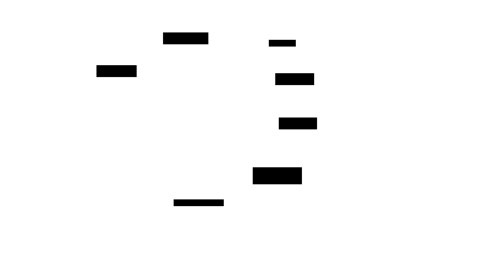

# Narrex — Software Architecture Design Document

**Status**: Draft
**Author**: zzoo
**Date**: 2026-03-07
**PRD Reference**: docs/prd.md, docs/prd-phase-1.md

---

## 1. Context & Scope

### 1.1 Problem Statement

Aspiring Korean web novel writers have stories to tell but cannot produce structured, multi-episode manuscripts. The bottleneck is not creativity — it is the labor of organizing dozens of interconnected events, maintaining character and plot consistency across 40+ episodes, and generating 3,000-5,000 characters of prose per episode. No existing tool — Korean or international — combines visual story structure with AI-powered scene-level drafting.

Narrex is a visual novel editor where the story is a timeline of events, not a blank page. Users arrange characters, relationships, and plot points on an interactive multi-track timeline, then generate AI prose scene by scene. The visual structure automatically assembles into the AI prompt — no prompt engineering required.

### 1.2 System Context Diagram

<picture>
  <source media="(prefers-color-scheme: dark)" srcset="./diagrams/system-context-dark.svg">
  <source media="(prefers-color-scheme: light)" srcset="./diagrams/system-context-light.svg">
  
</picture>

*Source: [diagrams/system-context.d2](./diagrams/system-context.d2)*

### 1.3 Assumptions

1. **Scene-level Korean prose generation is viable.** Frontier-class LLMs produce Korean prose good enough to revise, not discard. If quality is insufficient, the provider adapter abstraction enables rapid provider switching.
2. **Context compression preserves narrative fidelity.** AI-generated summaries of prior scenes maintain enough detail for consistency over 15-20 scenes (Phase 1 scope). Full 40+ episode support requires validation.
3. **Single developer for initial development.** Architecture optimizes for operational simplicity and development velocity over horizontal scalability.
4. **Desktop-first.** The timeline and editor require screen real estate >= 1280px. Mobile is out of scope.
5. **LLM API costs are the dominant variable cost.** At ~$0.03-0.06 per scene generation, cost optimization is an architectural concern from day one.
6. **Users tolerate 15-30s generation times** when output streams progressively (token-by-token rendering reduces perceived wait to <2s).

---

## 2. Goals & Non-Goals

### 2.1 Goals

- **Sub-30s AI generation** with streaming first token within 2s for scene-level drafts
- **< $5/month average AI cost per active user** at Basic plan usage patterns (100 generations/month)
- **Auto-save with < 1s perceived latency** for all user edits (timeline, characters, editor)
- **Context assembly under 500ms** — gathering config, characters, summaries, and relationships into a prompt before LLM call
- **Zero-downtime deployments** via Cloud Run rolling updates
- **Scale-to-zero** when no users are active (solopreneur cost optimization)
- **Provider-agnostic LLM integration** — switch between Gemini, Claude, and Ollama (local) via adapter traits without code changes
- **Support 1,000 concurrent users** at launch with horizontal auto-scaling

### 2.2 Non-Goals

- **Real-time collaboration** — single-author product. No conflict resolution, no WebSocket sync between users.
- **Mobile app** — desktop-first. No React Native or responsive mobile layout.
- **Multi-region active-active** — single region (us-east) sufficient for launch. CDN handles static asset distribution.
- **Fine-tuned models** — use prompt engineering and context assembly. Revisit if prose quality plateaus.
- **Offline support** — requires network for AI generation (core value).
- **Self-hosted LLM** — cloud API providers deliver better quality/cost ratio at current scale.

---

## 3. High-Level Architecture

### 3.1 Architecture Style

**System Architecture: Modular Monolith + SSE Streaming**

A single deployable Rust service organized into domain modules with clear boundaries. Modules communicate via in-process function calls and a lightweight internal event bus (for async side effects like summary generation). User-facing AI features use SSE streaming.

**Rationale**: Single developer, early-stage product. A modular monolith eliminates distributed system complexity (no service mesh, no inter-service auth, no distributed tracing) while maintaining domain isolation. Module boundaries are designed for future extraction — if the Generation module needs independent scaling, it can be extracted to a separate Cloud Run service without restructuring domain logic.

The Shopify/Toss pattern — start monolithic, extract only when data proves the boundary — is the right approach at this stage.

**Alternatives considered**:
- **Microservices**: Premature. Adds operational overhead (service discovery, inter-service auth, distributed tracing) that a single developer cannot maintain.
- **Serverless functions**: LLM generation requests run 15-30s, exceeding typical function timeout limits. Cloud Run's 300s request timeout is necessary. Serverless also makes streaming SSE responses harder to manage.

**Code Structure: Hexagonal (Ports & Adapters)**

Every domain module follows hexagonal architecture. Domain logic is pure — no framework, database, or LLM dependencies. All external interactions go through ports (Rust traits) with concrete adapters.

Dependencies always point inward. Domain code never imports framework or infrastructure code.

**Stack**:

| Layer | Technology | Deploy To |
|-------|-----------|-----------|
| Frontend | TanStack Start + SolidJS | Cloudflare Workers/Pages |
| Backend | Rust (Axum) | GCP Cloud Run (us-east4) |
| Database | Neon (PostgreSQL) | AWS us-east-1 (Virginia) |
| Cache | Upstash Redis | — |
| Object Storage | Cloudflare R2 | — |
| CDN / DNS | Cloudflare | Global edge |

### 3.2 Container Diagram

<picture>
  <source media="(prefers-color-scheme: dark)" srcset="./diagrams/container-dark.svg">
  <source media="(prefers-color-scheme: light)" srcset="./diagrams/container-light.svg">
  
</picture>

*Source: [diagrams/container.d2](./diagrams/container.d2)*

**API Design Philosophy**:

- **REST** with JSON payloads. Resources map to domain entities (projects, scenes, characters, drafts).
- **Versioning**: URL path (`/api/v1/...`). Breaking changes get a new version.
- **Pagination**: Cursor-based for lists (timeline scenes ordered by position, projects by last-edited).
- **Streaming**: SSE endpoint for AI generation (`/api/v1/scenes/{id}/generate`). Standard POST for non-streaming operations.

### 3.3 Component Overview

The API server is organized into domain modules:

| Module | Responsibility | Critical Path |
|--------|---------------|---------------|
| **auth** | OAuth2 flow, JWT issuance/validation, session management | Login, every authenticated request |
| **project** | Project CRUD, config management, file import parsing | Project creation, config updates |
| **timeline** | Scene CRUD, track management, ordering, branch/merge connections, vertical alignment | Scene manipulation, drag-and-drop |
| **character** | Character CRUD, relationship management, character cards | Character map interactions |
| **generation** | Context assembly, LLM prompt construction, provider adapter orchestration, streaming, summary generation | AI draft generation (core value) |
| **editor** | Draft storage, direction-based edit orchestration, text versioning | Editor interactions |
| **structuring** | Input analysis, auto-structure pipeline (text/file -> Config + Timeline + Characters) | Project creation (first impression) |

**Module dependencies** (inward only):
- `generation` depends on `project`, `timeline`, `character` (reads context for prompt assembly)
- `structuring` depends on `project`, `timeline`, `character` (writes initial structure)
- `editor` depends on `timeline`, `generation` (reads scene data, triggers re-generation)
- All modules depend on `auth` (middleware)

The `generation` module is the critical path — it orchestrates context assembly from multiple modules and manages the SSE streaming connection. It is the primary candidate for future extraction if scaling requires it.

---

## 4. Data Architecture

### 4.1 Data Flow

**Flow 1: Idea -> Auto-Structured Project (Core onboarding)**

```
User input (text or file)
  -> API: structuring module parses input
  -> LLM provider adapter: structured prompt requesting Config + Timeline + Characters
  <- LLM response (streamed): structured JSON
  -> API: writes to DB in single transaction
    -> project record (config values)
    -> track records
    -> scene records (with positions, track assignments)
    -> character records
    -> relationship records
  -> Response: complete workspace state
```

Consistency: Strong. All writes in a single database transaction. Client receives complete workspace state.

**Flow 2: Scene -> AI Draft Generation (Core value delivery)**

```
User clicks "Generate" on scene
  -> API: generation module assembles context
    -> Read: project config (DB, cached in Redis)
    -> Read: scene details (DB)
    -> Read: character cards + relationships for assigned characters (DB, cached)
    -> Read: compressed summaries of preceding scenes (DB/cache)
    -> Read: simultaneous scenes on other tracks (DB)
    -> Read: next scene title + summary (DB)
  -> Assemble structured prompt (template + all context)
  -> LLM provider adapter: streaming request
  <- SSE stream: tokens from LLM
  -> API: proxy SSE stream to client
  -> Client: renders tokens progressively in editor
  -> On stream complete:
    -> Store full draft text in DB
    -> Update scene status to "AI Draft"
    -> Async: generate compressed summary
      -> LLM provider adapter: summarization request (lightweight model)
      -> Store summary in DB + cache
```

Consistency: Draft write is strong (single row upsert). Summary generation is eventually consistent (async, non-blocking). If summary generation fails, it retries on next access.

**Flow 3: Direction-Based Edit (Partial regeneration)**

```
User selects text + enters direction ("more tension")
  -> API: receives selected range + direction + full draft
  -> API: generation module assembles context (same as Flow 2)
    + original full draft text
    + selected text range
    + user direction instruction
  -> LLM provider adapter: streaming request
  <- SSE stream: replacement text for selected range only
  -> Client: replaces selection with streamed output
  -> On complete: store updated draft in DB
```

### 4.2 Storage Strategy

| Store | Data | Why This Type | Consistency | Retention |
|-------|------|---------------|-------------|-----------|
| **Neon (PostgreSQL)** | Projects, scenes, tracks, connections, characters, relationships, drafts, summaries, users | Relational — entities have rich relationships (scenes->tracks, scenes->characters, characters->relationships). ACID transactions for workspace state. | Strong | Indefinite |
| **Upstash Redis** | Assembled prompt context cache, rate limit counters, refresh token blocklist | Key-value — fast reads for repeated context assembly. Atomic counters for rate limiting. | Eventual (cache) | TTL-based: context 15min, rate limits 1min |
| **Cloudflare R2** | Imported files (.md, .txt, .zip), character profile images, exported manuscripts [Phase 2] | Object storage — binary blobs, presigned URLs for direct client upload, zero egress fees. | Eventual | Indefinite |

**Why not a separate vector store**: Phase 1 does not use semantic search or RAG. The LLM receives structured context assembled from relational queries, not retrieved via embeddings. If Phase 3+ revision tools need semantic similarity search across manuscripts, add the pgvector extension to Neon rather than a separate vector database.

### 4.3 Caching Strategy

| Cached Data | Storage | TTL | Invalidation | Rationale |
|-------------|---------|-----|--------------|-----------|
| Assembled prompt context (config + character data) | Redis | 15 min | On config or character update (explicit delete) | Config and character data are stable between edits. Avoid re-querying on repeated generations within a session. |
| Scene summaries | Redis + DB (source of truth) | 1 hour | On draft change for that scene | Summaries are expensive (LLM call). Cache prevents recomputation for downstream generation. |
| User session data | Redis | 7 days (refresh token lifetime) | On logout or token rotation | Fast auth validation without DB hit per request. |

Cache stampede prevention is not a concern at Phase 1 scale. At scale, use Redis `SETNX`-based lock for summary regeneration.

---

## 5. Infrastructure & Deployment

### 5.1 Compute Platform

| Component | Platform | Region | Rationale |
|-----------|----------|--------|-----------|
| API Server | GCP Cloud Run | us-east4 (Virginia) | Container-based, auto-scaling, scale-to-zero. 300s request timeout for LLM streaming. Co-located with Neon (us-east-1, also Virginia — ~1-3ms inter-cloud latency). |
| Web Client | Cloudflare Workers/Pages | Global edge | Static assets + SSR at edge. TanStack Start deploys via Vinxi/Nitro to Workers natively. |

**Why Cloud Run**:
- **vs. Cloud Functions**: 60s default timeout (540s max). LLM streaming needs 300s. Cloud Run gives full timeout control.
- **vs. GKE**: Kubernetes operational overhead is unjustifiable for a single developer.
- **vs. Cloudflare Workers (for API)**: 30s CPU time limit. Context assembly + streaming exceeds this.

**Scaling model**:
- API Server: min 0, max 10 instances. Target: 80 concurrent requests per instance. Scale-to-zero during off-hours.
- Cold start budget: <2s (Rust binary cold starts in ~500ms on Cloud Run).

### 5.2 Deployment Strategy

```
PR merge -> GitHub Actions
  -> cargo build --release (multi-stage Docker)
  -> cargo test (unit + integration)
  -> Push container image to Artifact Registry
  -> gcloud run deploy (rolling update, traffic migration)
  -> Health check: /health returns 200
  -> Rollback: gcloud run services update-traffic (instant, previous revision)
```

Cloud Run retains previous revisions. Rollback is a traffic split operation (<5s), not a redeployment.

### 5.3 Environment Topology

| Environment | Infrastructure | Purpose |
|-------------|---------------|---------|
| Local dev | Docker Compose (PostgreSQL, Redis) + `cargo run` + Ollama (local LLM) | Development. Local DB via Docker, API runs natively for fast iteration. Free LLM via Ollama. |
| Staging | Cloud Run (staging service) + Neon branch + Gemini/Claude API keys | Pre-production validation. |
| Production | Cloud Run + Neon main + Gemini/Claude API keys | Live service. |

Local dev uses Docker Compose for PostgreSQL and Redis — no cloud dependency, offline-capable. Staging and production use Neon branches for identical schemas without separate database provisioning.

---

## 6. Cross-Cutting Concerns

### 6.1 Authentication & Authorization

**Auth flow**: Google OAuth2 -> self-issued JWT

```
Client -> Google OAuth2 consent screen
  -> Google callback with auth code
  -> API: exchange code for Google tokens
  -> API: create or find user in DB
  -> API: issue access token (JWT, 15min) + refresh token (opaque, 30 days, httpOnly cookie)
  -> Client: stores access token in memory
```

**Token lifecycle**:
- Access token: JWT, 15min expiry, RS256 signed. Contains `user_id`, `email`.
- Refresh token: opaque random string, 30 days, httpOnly + Secure + SameSite=Strict cookie. Stored in Redis. Rotated on each use (old token invalidated).

**Authorization model**: Ownership-based. Users access only their own projects. Enforced at query level (`WHERE user_id = $1`) and validated in middleware. No RBAC — single-user product with no roles.

### 6.2 Observability

**Logging**:
- Structured JSON to stdout (Cloud Run -> Cloud Logging)
- Fields: `timestamp`, `level`, `request_id`, `user_id`, `module`, `message`, `duration_ms`
- AI-specific fields on every LLM call: `model`, `token_count_input`, `token_count_output`, `cost_usd`, `generation_type`

**Metrics** (Cloud Monitoring):
- RED per endpoint (rate, errors, duration)
- AI-specific: generations/min, avg tokens/generation, cost/user/day, TTFT
- Business: projects created/day, scenes with drafts/day

**Alerting**:
- Error rate > 5% over 5 min
- p99 latency > 10s for non-generation endpoints
- LLM adapter error rate > 10%
- Daily AI cost > $50

**Tracing**: Not needed Phase 1 (modular monolith — single process). Add OpenTelemetry if services are extracted.

### 6.3 Error Handling & Resilience

**LLM generation failures** (most critical path):
- Retry: 1 automatic retry with 2s backoff on 5xx from LLM provider
- Fallback: adapter switches to secondary provider (Claude) if primary (Gemini) fails
- User-facing: "Couldn't generate this scene. Check your connection and try again." + Retry button
- Partial draft preservation: if stream interrupts mid-generation, store whatever was received

**Database failures**:
- Connection pool: 5 connections per Cloud Run instance via Neon pooler
- Retry: 1 retry with 500ms backoff on connection errors
- User-facing: auto-save retries silently; shows "Connection issue" if persistent

**Timeout budgets**:

| Path | Timeout | Rationale |
|------|---------|-----------|
| LLM adapter -> Provider (scene generation) | 120s | Long generations with streaming |
| LLM adapter -> Provider (summary, structuring) | 60s | Shorter, non-streaming |
| API -> Neon | 5s | DB queries should be fast |
| API -> Redis | 1s | Cache miss falls through to DB |
| Client -> API (generation) | 150s | Includes overhead above streaming |
| Client -> API (CRUD) | 10s | Standard operations |

### 6.4 Security

- **Transport**: TLS 1.3. Cloudflare terminates TLS at edge. Cloud Run enforces HTTPS.
- **Data at rest**: Neon AES-256 encryption. R2 encryption at rest. No column-level encryption needed (no sensitive PII beyond email).
- **Secrets**: `pulumi config set --secret`. Secrets: DB connection string, OAuth client secret, JWT signing key, LLM API keys. Upgrade to GCP Secret Manager when team grows.
- **Input validation**: All inputs validated via `validator` crate. Plot summaries and text sanitized. File uploads validated by extension and MIME type. Max 10K chars for text inputs, 10MB for file uploads.
- **Rate limiting**: Upstash Redis. 100 requests/min per user for CRUD. 10 generations/min per user. Prevents AI cost abuse.
- **OWASP**:
  - Injection: Parameterized queries via SQLx (compile-time checked)
  - XSS: API returns JSON only. SolidJS auto-escapes.
  - CSRF: SameSite=Strict cookies + Bearer token auth
  - Broken auth: JWT validation on every request. Refresh token rotation.

### 6.5 Testing Architecture

**Strategy**: Unit-heavy pyramid. Domain logic (context assembly, prompt construction, scene ordering) is pure and extensively unit-tested. Integration tests cover adapter boundaries.

| Layer | What | How | Target |
|-------|------|-----|--------|
| Unit | Domain logic: context assembly, scene ordering, prompt templates, validation rules | `cargo test` — pure functions, no mocks needed (hexagonal ports make domain dependencies-free) | 80%+ domain module coverage |
| Integration | DB adapters (SQLx queries), LLM provider adapters, R2 client | `cargo test` with Neon branch + Ollama (local LLM) | All adapter boundaries |
| E2E | Core journey: create project -> auto-structure -> generate draft -> edit | Playwright against staging | 3 critical flows |
| AI quality | Generation output quality, summary fidelity, Korean prose naturalness | LLM-as-judge evaluation (50 test scenarios across 3 genres) | Weekly, not per-PR |

**Mocking**: Hexagonal ports (Rust traits) make mocking natural. Domain tests use in-memory trait implementations. No mock frameworks needed.

### 6.6 Performance & Scalability

**Expected load profile**:
- Launch: 100-500 DAU, ~5 concurrent users, ~500 generations/day
- Growth: 5K-10K DAU, ~50 concurrent, ~5K generations/day
- Peak: Evening KST (7-11 PM), 3x average

**Bottlenecks and mitigation**:

| Bottleneck | Impact | Mitigation |
|-----------|--------|------------|
| Context assembly (multiple DB queries) | Latency before LLM call | Cache assembled context in Redis (15min TTL). Batch queries (all characters + relationships in 2 queries, not N+1). |
| LLM generation (15-30s) | Blocks user | SSE streaming (perceived latency <2s TTFT). Prompt caching for stable prefix. Model cascading Phase 2. |
| Summary generation after draft save | Could block save | Async via internal event bus. Non-blocking. Retry on next access if failed. |
| File import parsing (Notion .zip) | Large files timeout | Parse asynchronously. Return "processing" status. Poll for completion. |

---

## 7. Integration Points

| External System | Provides | Protocol | Failure Mode | SLA Dependency |
|----------------|----------|----------|--------------|----------------|
| **Google AI (Gemini)** | Text generation (primary), summarization | HTTPS via `GeminiAdapter` | Adapter falls back to Claude. User sees retry if all fail. | High — core feature. ~99.9%. |
| **Anthropic (Claude)** | Text generation (fallback), quality-critical tasks | HTTPS via `AnthropicAdapter` | User sees retry if both providers fail. | Medium — secondary provider. ~99.9%. |
| **Google OAuth2** | User authentication | HTTPS (OAuth2 code flow) | Login fails. Existing sessions unaffected (JWT valid until expiry). | Low — new logins only. |
| **Neon** | PostgreSQL database | TCP via pooler | All data operations fail. Auto-save queues retries. | Critical — 99.95% SLA. |
| **Upstash Redis** | Caching, rate limiting | HTTP/TCP | Cache misses fall through to DB. Rate limiting temporarily disabled. Graceful degradation. | Low — slow, not broken. |
| **Cloudflare R2** | File storage | S3-compatible HTTPS | File upload/download fails. Core features unaffected. | Low — secondary entry path. |
| **Cloudflare Workers** | Frontend hosting | HTTPS | Frontend down. API operational. | Medium — app inaccessible. |

---

## 8. Risks & Open Questions

### 8.1 Technical Risks

| Risk | Impact | Likelihood | Mitigation |
|------|--------|------------|------------|
| Context assembly prompt exceeds LLM context window at 15+ scenes | Degraded generation quality or truncation | Medium | Token budget management: 16K tokens for context, truncate oldest summaries first. Monitor total tokens per generation. |
| SSE streaming drops connection on long generations | Incomplete drafts | Low | Cloud Run supports SSE natively. 300s timeout. Client reconnection with last-received position. Store partial drafts server-side. |
| Neon cold starts add latency after idle | Slow first request | Medium | ~500ms cold start, acceptable. Configure minimum compute during peak hours if problematic. |
| Korean prose quality below "worth editing" threshold | Core value proposition fails | Medium | Pre-launch: test 50+ scenes across 3 genres with target users. Adapter enables switching between Gemini and Claude. Genre-specific prompt engineering. |
| Summary compression loses critical details over 20+ scenes | Later scenes contradict earlier ones | Medium | Phase 1: full summaries (not summary-of-summaries). Tiered compression if token budget exceeded: recent 5 scenes full, older scenes ultra-compressed. |

### 8.2 Open Questions

1. **Ollama model selection for local development.** Which model provides acceptable Korean prose quality for free local iteration? Candidates: llama3, gemma2, EEVE-Korean. *Needs: local quality benchmarking. Owner: zzoo.*

2. **Summary compression fidelity at scale.** Does compounding summarization maintain narrative detail over 20+ scenes? *Needs: test with 25-scene manuscript, measure contradiction rate. Owner: zzoo.*

3. **Notion .zip import depth.** Notion exports have complex internal structure. How deep should parsing go? *MVP answer: extract text content only, ignore Notion-specific structure (databases, toggles). Owner: zzoo.*

---

## 9. Architecture Decision Records (ADRs)

### ADR-1: Backend Language — Rust (Axum)

- **Status**: Accepted
- **Context**: Narrex needs a backend that handles SSE streaming for AI generation, maintains low per-request cost (solopreneur economics), and provides compile-time safety for a solo developer without peer code review.
- **Decision**: Rust with Axum framework on GCP Cloud Run.
- **Alternatives Considered**:
  - **FastAPI (Python)**: Rejected. The project had initial FastAPI scaffolding, and Python has mature LLM tooling. However, LLM API calls are just HTTP — Rust handles this with `reqwest` + `serde`. Python's runtime overhead (50-100MB memory vs. 10-30MB for Rust) and slower cold starts increase per-instance cost. Python is only justified when PyTorch/transformers are required, which Narrex does not use.
  - **Hono (TypeScript)**: Rejected. Cloudflare Workers' 30s CPU time limit conflicts with long-running generation requests. Would require splitting into edge and non-edge services, adding complexity.
- **Consequences**: (+) Sub-ms response times, 10-30MB memory, near-zero cold starts, compiler eliminates entire error classes. (-) Smaller ecosystem than Python for AI tooling. Steeper learning curve for future contributors.

### ADR-2: Frontend Framework — TanStack Start + SolidJS

- **Status**: Accepted
- **Context**: The workspace UI requires fine-grained reactivity for the multi-track timeline (drag-and-drop, scene state updates, panel resizing) and streaming text rendering in the editor.
- **Decision**: TanStack Start (SSR) + SolidJS (reactive UI) on Cloudflare Workers.
- **Alternatives Considered**:
  - **Next.js (React)**: Rejected. React's virtual DOM diffing is unnecessary overhead for the timeline — when a single scene's status changes, only that scene needs to update. SolidJS's fine-grained reactivity handles this surgically. The React ecosystem advantage (shadcn/ui, Radix) is not critical — Narrex has a custom design system ("Ink & Amber").
- **Consequences**: (+) Smaller bundles, surgical DOM updates, no virtual DOM overhead. (-) Smaller component ecosystem. Some libraries (rich text editors) may need custom SolidJS implementations.

### ADR-3: System Architecture — Modular Monolith

- **Status**: Accepted
- **Context**: Single developer, early-stage product. Need domain separation without operational overhead.
- **Decision**: Single deployable Rust binary with domain modules (auth, project, timeline, character, generation, editor, structuring). In-process communication. Internal event bus for async side effects.
- **Alternatives Considered**:
  - **Microservices**: Rejected. Single developer cannot maintain service mesh, distributed tracing, inter-service auth, and independent deployment pipelines. Premature decomposition leads to distributed monolith.
  - **Serverless functions**: Rejected. 15-30s streaming exceeds function timeout limits. Cold starts degrade workspace UX.
- **Consequences**: (+) Simple deployment, no network overhead between modules, single Dockerfile, easy local dev. (-) Scales as a whole unit. Module boundary enforcement requires discipline.

### ADR-4: Database — Neon (Serverless PostgreSQL)

- **Status**: Accepted
- **Context**: Richly interconnected entities (projects, scenes, tracks, characters, relationships) need relational modeling. Global audience.
- **Decision**: Neon in us-east-1 (Virginia).
- **Alternatives Considered**:
  - **Supabase (Seoul)**: Rejected. Global audience means Seoul region is suboptimal. Neon's branching and scale-to-zero are better aligned with solopreneur cost model.
  - **GCP Cloud SQL**: Rejected. No scale-to-zero — minimum ~$7/month idle. Neon charges only for compute time.
  - **PlanetScale/Turso**: Rejected. MySQL/SQLite ecosystems. PostgreSQL (pgvector, extensions) is more future-proof for AI features.
- **Consequences**: (+) Scale-to-zero, branching for dev/staging, full PostgreSQL, pgvector ready. (-) Cross-cloud latency (Neon on AWS, API on GCP) — mitigated by same-region co-location (~1-3ms).

### ADR-5: Compute Platform — GCP Cloud Run

- **Status**: Accepted
- **Context**: Need container hosting with auto-scaling, scale-to-zero, and 300s request timeout for LLM streaming.
- **Decision**: GCP Cloud Run for API server. Cloudflare Workers/Pages for frontend.
- **Alternatives Considered**:
  - **AWS Lambda/Fargate**: Rejected. Cloud Run has simpler pricing, native container support, generous free tier (2M requests/month).
  - **Fly.io**: Rejected. Less mature than Cloud Run. GCP ecosystem (Pub/Sub, Cloud Tasks, Cloud Logging) provides better platform cohesion.
- **Consequences**: (+) Scale-to-zero, 300s timeout, auto-scaling, GCP ecosystem. (-) Cold starts (~500ms, acceptable). Vendor lock-in mitigated by containerization.

### ADR-6: Authentication — Google OAuth2 + Self-Issued JWT

- **Status**: Accepted
- **Context**: Global audience, solopreneur — simplest auth with widest reach.
- **Decision**: Google OAuth2 for identity. Self-issued JWT (RS256) for sessions. Refresh tokens in httpOnly cookies.
- **Alternatives Considered**:
  - **Auth0/Clerk**: Rejected. Adds cost ($23+/month beyond free tier) and critical external dependency. Single OAuth provider is straightforward to implement.
  - **Supabase Auth**: Rejected. Creates Supabase dependency when using Neon for DB.
  - **Kakao + Naver OAuth**: Deferred — can be added as additional providers without architectural changes.
- **Consequences**: (+) Zero cost, full control, no third-party auth dependency. (-) Must implement token rotation and refresh flow manually.

### ADR-7: LLM Integration — Rust Provider Adapters + SSE Streaming

- **Status**: Accepted
- **Context**: PRD requires provider-agnostic LLM with failover and cost tracking. Narrex uses only 2 providers (Gemini primary, Claude secondary) + Ollama for local dev. Generation must stream to users.
- **Decision**: Hexagonal `LlmPort` trait in Rust with concrete adapters (`GeminiAdapter`, `AnthropicAdapter`, `OllamaAdapter`). All LLM calls happen inside the API server process. SSE streaming from API to client.
- **Alternatives Considered**:
  - **LiteLLM (Python gateway)**: Rejected. Adds a separate Cloud Run service, Python dependency, and ~50ms network hop per LLM call. LiteLLM supports 100+ providers — overkill for 2 providers. Failover, cost tracking, and retry logic are straightforward to implement in Rust.
  - **Direct API calls (no abstraction)**: Rejected. Provider lock-in. No failover. No unified cost tracking.
- **Consequences**: (+) Single deployable binary. No Python dependency. Zero network overhead for LLM calls. Type-safe provider switching via traits. (-) Must implement provider-specific streaming APIs in Rust (~1 week for 3 adapters using `reqwest` + `async-stream`).

---

## 10. AI/LLM Architecture

### 10.1 LLM Integration Pattern

**Hexagonal Provider Adapters** — LLM calls are abstracted behind a Rust trait (`LlmPort`) with concrete adapters per provider.

```rust
// Port (domain boundary)
trait LlmPort: Send + Sync {
    async fn generate_stream(&self, prompt: StructuredPrompt) -> Result<impl Stream<Item = Token>>;
    async fn generate(&self, prompt: StructuredPrompt) -> Result<String>;
}

// Adapters (infrastructure)
struct GeminiAdapter { /* reqwest client, API key */ }    // Primary — cost-optimized
struct AnthropicAdapter { /* reqwest client, API key */ }  // Secondary — quality fallback
struct OllamaAdapter { /* local endpoint */ }              // Local dev only
```

**Provider routing**:
- **Gemini** (primary): All generation tasks. Best cost/quality ratio for Korean prose.
- **Claude** (fallback): Activated on Gemini failure or for quality-critical tasks.
- **Ollama** (local): Development only. Free iteration without API costs.

**Model Cascading [Phase 2]**: Route by task type:

| Task | Model Tier | Example |
|------|-----------|---------|
| Inline suggestions | Lightweight ($) | Gemini Flash |
| Scene generation | Mid-tier ($$) | Gemini Pro |
| Structure planning / quality-critical | Frontier ($$$) | Claude Sonnet |

Phase 1 uses Gemini Pro for all tasks, with Claude as automatic fallback on failure.

### 10.2 Streaming Architecture

**Protocol**: SSE (Server-Sent Events)

```
Client --POST /api/v1/scenes/{id}/generate--> API Server (LlmPort adapter)
       <--text/event-stream (SSE)--          Adapter --HTTPS--> Gemini / Claude
```

- **API Server**: Axum `Sse` response with `async-stream`. Adapter streams tokens directly to client, buffering only for token counting.
- **Client**: `fetch()` + `ReadableStream`. SolidJS signal updates on each token for reactive editor rendering.
- **Timeout**: 300s Cloud Run. 150s client-side with reconnection logic.
- **Backpressure**: Not a concern — LLM token rate (~50-100 tok/s) is far below network throughput.

**Why SSE over WebSocket**: SSE is stateless, HTTP-native, works with serverless. WebSocket is only justified for bidirectional real-time (collaboration, voice) — neither applies here.

### 10.3 Context Assembly Pipeline

The pipeline that transforms visual structure into effective prompts. Runs on every generation request.

```
Context Assembly Pipeline
===========================

1. Project Config (budget: ~500 tokens)
   genre, theme, era/location, POV, tone

2. Current Scene (budget: ~1K tokens)
   title, plot summary, location, mood tags

3. Characters — filtered to this scene (budget: ~2K tokens)
   name, personality, appearance, secrets, motivation
   + relationships between assigned characters

4. Narrative Context (budget: ~11K tokens, flexible)
   compressed summaries of preceding scenes
   ordered by timeline position

5. Parallel Context (budget: ~1K tokens)
   simultaneous events on other tracks
   (vertically aligned scenes)

6. Forward Context (budget: ~500 tokens)
   next scene title + summary (if exists)

   ============> Structured Prompt Template
   ============> LLM provider adapter (streaming)
```

**Token budget management**:
- Total context budget: 16K tokens (leaves room for generation output)
- Priority: Config > Current Scene > Characters > Forward > Parallel > Narrative
- If narrative summaries exceed budget, truncate oldest first (most distant events are least relevant)

**Prompt templates**: Version-controlled in the codebase. Structured with clear section delimiters. Changes tested via AI quality eval suite.

### 10.4 Summary Compression

When a draft is saved, a compressed summary is generated asynchronously:

```
Draft text (1,500-3,000 chars)
  -> LLM (lightweight model): "Summarize for narrative context"
  -> Summary (200-400 chars):
     - What happened (plot progression)
     - Who was involved (character actions)
     - What changed (relationships, new info, emotional state)
     - What was set up (potential foreshadowing)
  -> Stored in DB + cached in Redis (1hr TTL)
```

**Quality risk**: Compounding summarization loses detail over 20+ scenes. Phase 1 mitigation: use full summaries, not summary-of-summaries. Monitor context token usage. If budget exceeded, implement tiered compression: recent 5 scenes full summaries, older scenes ultra-compressed.

### 10.5 Cost Optimization

| Strategy | Phase | Expected Impact |
|----------|-------|-----------------|
| Prompt caching (stable prefix: config + character data) | Phase 1 | 20-40% cost reduction on repeated generations |
| Summary compression (200-400 chars vs. 3K char drafts) | Phase 1 | 5-10x reduction in narrative context tokens |
| Lightweight model for summaries | Phase 1 | Summary at ~10% cost of scene generation |
| Model cascading by task type | Phase 2 | 70-80% reduction for inline suggestions |
| Semantic caching for similar prompts | Phase 3+ | 30-50% for common scene patterns |

**Cost monitoring**: Log `token_count_input`, `token_count_output`, `model`, `cost_usd` per LLM call. Aggregate per-user daily cost. Alert if any user exceeds $5/day.

### 10.6 Guardrails

**Input validation**:
- Text inputs: max 10K characters (prevents prompt injection via oversized inputs)
- File imports: max 10MB, validated file types
- Rule-based filter: reject system prompt injection patterns

**Output validation**:
- Length check: truncate + warn if output exceeds 2x expected
- No PII detection needed (creative fiction)
- No factuality check needed (creative generation)

**Content safety**: Rely on LLM provider built-in safety filters. Overly restrictive filtering harms creative fiction usability. Adapter routes to alternative provider if one blocks creative content inappropriately.

### 10.7 AI-Specific Observability

| Metric | Collection | Alert Threshold |
|--------|-----------|-----------------|
| Token usage (input/output) per request | Logged on every LLM call | — (monitoring) |
| Cost per request, per user, per day | Aggregated from token logs | > $5/user/day |
| Time-to-first-token (TTFT) | First SSE event timestamp | > 5s at p95 |
| Generation failures | Adapter error count | > 10% over 5 min |
| Context assembly time | Pipeline timer | > 500ms at p95 |
| Summary quality | Weekly manual review (20 samples) | — (manual) |

---

## 11. Phase Implementation Summary

### Phase 1: Core Loop MVP

**Components**:
- API Server: auth, project, timeline, character, generation, editor, structuring modules
- LLM adapters: GeminiAdapter (primary) + AnthropicAdapter (fallback) + OllamaAdapter (local dev)
- Web Client: Dashboard, Project Creation, Workspace (Config Bar, Timeline, Character Map, Editor, Scene Detail)

**Infrastructure**:
- GCP Cloud Run (API server — single service)
- Neon PostgreSQL (us-east-1)
- Cloudflare Workers/Pages (frontend)
- Upstash Redis (cache, rate limiting)
- Cloudflare R2 (file storage)

**Key ADRs**: All (ADR-1 through ADR-7)

**AI**: Single-model generation, SSE streaming, full context assembly pipeline, summary compression, prompt caching

### Phase 2: Episode Layer + Polish

**New components**:
- Episode organization module (API) — event-to-episode mapping, dividers, word count
- AI Chat panel (context-aware assistant)
- Export module (DOCX, EPUB, plain text)
- Draft variations (2-3 per scene) + comparison UI
- Tone/style sliders
- Foreshadowing connection lines
- Inline autocomplete
- Genre template gallery
- Onboarding tutorial

**New integrations**:
- Model cascading via adapter config (Gemini Flash / Gemini Pro / Claude Sonnet)
- Batch API for background generation (export prep)
- GCP Cloud Tasks for background jobs (export generation)

**Infrastructure additions**:
- GCP Cloud Tasks
- Potential Neon read replica for heavy read paths

### Phase 3+: Depth + Delight

**New components**:
- World map module + UI (real and fictional maps)
- Temporal relationship tracking (relationships change over story time)
- Revision tools (character consistency, foreshadowing verification, contradiction detection, style review)
- AI Surprise mode
- AI gap detection (suggests missing scenes)
- AI character/relationship suggestions

**New integrations**:
- pgvector extension on Neon (semantic search for revision tools)
- Semantic caching via Redis vector search

**Infrastructure evaluation**:
- Dedicated vector store if pgvector hits limits
- GCP Pub/Sub for event-driven revision processing across large manuscripts
