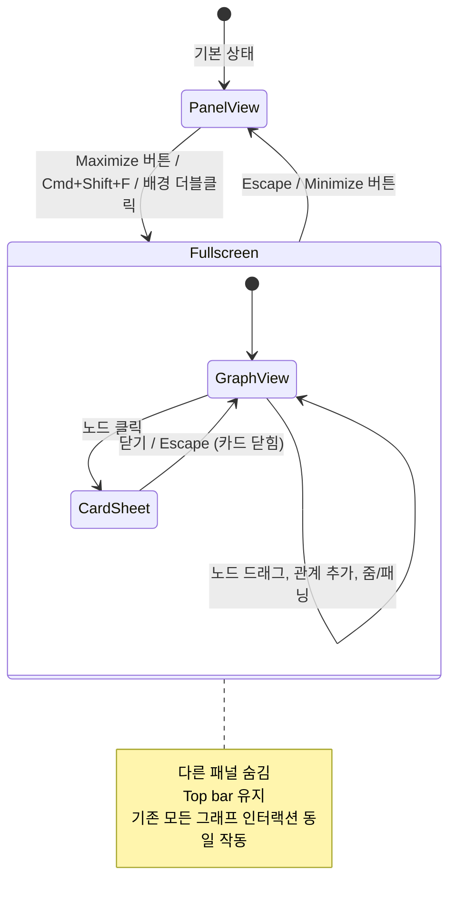

# UX Design: Fullscreen Character Map

## 1. Context

### User Goal (JTBD)

> 복잡한 캐릭터 관계 구조를 탐색하고 편집할 때, 더 넓은 공간에서 전체 관계도를 한눈에 보고 싶다. 좁은 사이드 패널 안에서 노드가 겹치거나 레이블이 잘리는 문제 없이 캐릭터 간의 관계를 파악하고 조정할 수 있어야 한다.

### User Context

- **Device**: Desktop (768px+ enforced, 주 대상 1280px+)
- **Environment**: 집중적인 글쓰기 세션 중 "관계 정리" 시간에 진입
- **Mental State**: 창작 모드 -- 탐색적이면서도 구조적 사고가 필요한 상태
- **Time Pressure**: 낮음 -- 심층 작업 (deep work)

### Proto-Persona

```
Name:           지원 (Jiwon)
Role:           웹소설 작가, 10+ 캐릭터 프로젝트 진행 중
Goal:           캐릭터 간 관계를 시각적으로 확인하면서 빠진 관계를 추가하고 정리
Context:        데스크톱, 2시간 이상 집필 세션 중 중간에 관계도 점검
Frustrations:   280px 패널에서 8+ 캐릭터가 겹침, 레이블 읽기 어려움, drag 공간 부족
Tech Comfort:   High
```

---

## 2. Information Architecture

### Navigation Pattern: Overlay (Fullscreen Modal)

**선택 근거**: 풀스크린 캐릭터 맵은 기존 작업 공간 위에 오버레이되는 "확대 모드"이다. 별도의 페이지가 아니라 현재 컨텍스트 안에서의 뷰 전환이다. 이는 일반적인 creative tool의 관례를 따른다 (Figma의 presentation mode, VS Code의 Zen Mode, 영상편집 소프트웨어의 reference monitor fullscreen).

**Jakob's Law** -- creative tool 사용자들은 `F` 키나 maximize 아이콘으로 특정 패널을 확대하는 패턴에 익숙하다.

### Screen Hierarchy

```
Workspace
├── Top Bar (header)
├── Left Panel: Character Map (default)
│   ├── Graph View
│   └── Character Card View
├── Center: Editor Panel
├── Right Panel: Scene Detail
├── Bottom Panel: Timeline
│
└── [Overlay] Fullscreen Character Map    <--- NEW
    ├── Toolbar (top)
    ├── Graph View (expanded)
    └── Character Card (side sheet, conditional)
```

### Entry Points

1. **Maximize 버튼**: Character Map 헤더의 기존 collapse 버튼 옆
2. **Keyboard Shortcut**: `Cmd+Shift+F` (Fullscreen)
3. **Double-click empty area**: Graph 배경 더블클릭 (discovery 진입점)

---

## 3. User Flow

### Critical Path

```
패널 뷰 → [Maximize 클릭/Cmd+Shift+F] → Fullscreen → [작업: 탐색/편집/관계 추가] → [Escape/Minimize 클릭] → 패널 뷰 복귀
```

### Flow Diagram (Mermaid)



### Edge Cases

| Scenario | Behavior |
|----------|----------|
| Right panel (Scene Detail) 열린 상태에서 fullscreen 진입 | Right panel 닫히지 않음 -- fullscreen이 전체를 덮으므로 보이지 않을 뿐. 복귀 시 원래 상태 그대로 |
| Config dropdown 열린 상태에서 fullscreen 진입 | Config dropdown 먼저 닫히고 fullscreen 진입 |
| 캐릭터가 0명일 때 fullscreen 진입 | Fullscreen에서 empty state 표시 (패널 뷰와 동일한 empty state 메시지 + "등장인물 추가" CTA) |
| Fullscreen 상태에서 `Cmd+\` (패널 토글) 입력 | 무시 -- fullscreen이 패널 시스템 위에 존재하므로 패널 토글과 무관 |
| Fullscreen 상태에서 `Escape` 입력 | **Character Card가 열려 있으면**: Card 먼저 닫힘. **Card 없으면**: Fullscreen 종료 |
| 브라우저 resize로 768px 미만이 되었을 때 | Fullscreen 자동 종료, 모바일 경고 화면으로 전환 (기존 동작) |

---

## 4. Screen Specifications

### 4.1 Entry Point: Character Map Header (Modified)

현재 헤더에 Maximize 버튼을 추가한다.

```
┌────────────────────────────────────────────────────┐
│  CHARACTERS         [+ 등장인물 추가] [⤢] [◁]     │
│                                       ↑     ↑      │
│                               Maximize  Collapse    │
└────────────────────────────────────────────────────┘
```

**Maximize 버튼 사양**:
- **Icon**: `IconMaximize` (이미 존재, 대각선 확대 화살표 -- `icons.tsx` line 59)
- **Size**: 14px 아이콘, 24x24px 터치 영역
- **Style**: `ghost` -- `p-1 rounded-md text-fg-muted hover:text-fg hover:bg-surface-raised transition-colors cursor-pointer`
- **aria-label**: `"전체 화면으로 보기"` (ko) / `"View fullscreen"` (en)
- **Position**: Add 버튼과 Collapse 버튼 사이
- **Tooltip**: 없음 (아이콘이 self-explanatory, 대각선 화살표는 universal convention)

**원칙**: Fitts's Law -- Maximize 버튼은 사용자가 이미 헤더 영역에서 작업 중일 때 최소 거리로 접근 가능한 위치에 배치. Von Restorff Effect -- 동일한 ghost 스타일을 유지하여 collapse 및 add 버튼과 시각적 무게를 동일하게 유지. Fullscreen은 primary 작업이 아니라 secondary 도구이다.

---

### 4.2 Fullscreen Character Map (New Screen)

#### Identity
- **Screen name**: Fullscreen Character Map
- **Route**: 별도 route 없음 -- 현재 workspace route에서 오버레이 상태로 관리
- **State signal**: `fullscreenCharMap: boolean` (WorkspaceLayout에 추가)

#### Layout

```
┌─────────────────────────────────────────────────────────────────────┐
│ [← Narrex · 프로젝트 제목]                   [설정] [🌙]  [저장됨] │  ← Top bar (기존 유지)
├─────────────────────────────────────────────────────────────────────┤
│                                                                     │
│  ┌──────────────────────────────────────────────────────────────┐   │
│  │  CHARACTERS         [+ 등장인물 추가]  [Zoom −] [Zoom +] [⤡]│   │  ← Fullscreen toolbar
│  ├──────────────────────────────────────────────────────────────┤   │
│  │                                                              │   │
│  │                                                              │   │
│  │               [D3 Force-Directed Graph]                      │   │
│  │                    (전체 공간 활용)                            │   │
│  │                                                              │   │
│  │                                                              │   │
│  │                                                              │   │
│  │                                                              │   │
│  │                                                              │   │
│  │                                                              │   │
│  └──────────────────────────────────────────────────────────────┘   │
│                                                                     │
└─────────────────────────────────────────────────────────────────────┘
```

#### Key Design Decisions

**1. Top Bar 유지**

Top bar는 그대로 둔다. 이유:
- **Principle of Front Doors (IA)** -- 사용자가 어느 프로젝트에서 작업 중인지 항상 알아야 한다.
- 프로젝트 제목, 저장 상태, 테마 토글 등은 컨텍스트 정보로 항상 필요하다.
- Top bar를 숨기면 "어디 있는지" 혼란이 생긴다. 44px 높이는 무시할 만한 공간 손실이다.
- **참고**: Figma, Linear 등도 overlay 모드에서 top bar를 유지한다.

**2. Fullscreen 영역은 Top bar 아래 전체**

좌/우/하 패널이 모두 숨겨지고, center 영역이 전체 너비를 차지한다. 구현상으로는:
- `leftOpen`, `rightOpen`, `bottomOpen` 상태를 건드리지 않는다 (복귀 시 원래 상태 필요).
- Fullscreen overlay가 panels 위에 렌더링된다 (`z-index: 40`, top bar의 `z-30` 위).
- 즉, DOM 상에서는 기존 패널들 위에 absolute/fixed 오버레이.

**3. Fullscreen Toolbar**

패널 뷰의 헤더와 유사하지만, 확대 상태에 맞는 컨트롤 포함.

```
┌──────────────────────────────────────────────────────────────────┐
│  CHARACTERS         [+ 등장인물 추가]     [−] [+]          [⤡]  │
│  (label)            (primary action)  (zoom controls)  (minimize)│
└──────────────────────────────────────────────────────────────────┘
```

- **Title**: "CHARACTERS" -- 패널 헤더와 동일한 uppercase tracking-wide 스타일
- **Add button**: 동일한 `[+ 등장인물 추가]` 버튼
- **Zoom controls**: `[−]` / `[+]` 버튼 쌍 (아래 상세)
- **Minimize button**: `IconMinimize` (대각선 축소 화살표, maximize의 역방향). 아이콘이 없으면 기존 `IconMaximize`를 그대로 사용하되 의미를 `aria-label`로 구분 (`"패널 뷰로 돌아가기"`)
- **Collapse 버튼은 제거**: Fullscreen에서 collapse는 의미 없음 (패널이 아니므로)

**Toolbar 높이**: 40px (h-10), 패널 헤더와 동일.
**Toolbar 스타일**: `bg-surface border-b border-border-subtle` -- 패널 헤더와 시각적으로 연속성 유지.

**원칙**: Cognitive Load Theory -- 패널 뷰에서 이미 학습한 레이아웃과 동일한 시각 구조를 유지하여 extraneous load를 최소화한다.

---

#### Primary Action

**탐색 및 편집** -- 사용자가 넓은 공간에서 캐릭터 관계도를 전체적으로 파악하고, 노드를 재배치하며, 관계를 추가/수정하는 것.

#### Information Shown

패널 뷰와 동일한 정보:
- Character nodes (circle + initials/avatar + name label)
- Relationship lines (solid/dashed/arrowed + labels)
- Edge handles for relationship creation

추가 정보 없음. Fullscreen은 더 많은 정보를 보여주는 것이 아니라 동일한 정보를 더 넓은 공간에서 보여주는 것이다.

**원칙**: Cognitive Load Theory -- 불필요한 새 요소를 추가하지 않는다. 넓은 공간 자체가 가치이다.

#### All 7 States

| State | Design |
|-------|--------|
| **Empty** | 패널 뷰와 동일한 empty state 메시지를 fullscreen 중앙에 표시. "아직 등장인물이 없습니다." + `[등장인물 추가]` CTA. 넓은 공간에서도 중앙 정렬, 최대 너비 320px으로 제한하여 읽기 편하게 |
| **Loading** | 해당 없음 -- 캐릭터 데이터는 이미 메모리에 있음 (workspace context에서 로드됨). Fullscreen 진입 시 별도 로딩 없음 |
| **Loaded** | 전체 화면 그래프 -- D3 simulation이 새 크기에 맞춰 re-center |
| **Error** | 해당 없음 -- 클라이언트 사이드 데이터. 시뮬레이션 오류 시 패널 뷰로 자동 복귀 |
| **Partial** | 해당 없음 |
| **Refreshing** | 해당 없음 |
| **Offline** | 기존 workspace의 offline 처리에 위임 (현재 Phase 1에서는 로컬 데이터만 사용) |

---

### 4.3 Graph View in Fullscreen

#### D3 Simulation Adaptation

Fullscreen 진입 시:

1. **SVG 크기**: `svgRef.clientWidth/clientHeight`가 자동으로 fullscreen 크기 반영 (기존 `absolute inset-0 w-full h-full` CSS 그대로)
2. **Force re-center**: `d3.forceCenter(newWidth / 2, newHeight / 2)`로 중심점 갱신
3. **Simulation reheat**: `simulation.alpha(0.3).restart()` -- 노드들이 새 공간에 맞게 자연스럽게 재배치
4. **기존 노드 위치 유지**: `fx/fy`가 설정된 고정 노드는 그대로. 자유 노드만 새 중심에 맞게 이동

**이 방식의 근거**: 사용자가 수동으로 배치한 노드를 존중하면서도, 더 넓은 공간에서 겹침 문제가 자연스럽게 해소된다.

#### Force Scaling (Area-Proportional)

현재 charge/link/collide가 고정값(`-300`, `120`, `45`)이라 패널 뷰에서는 노드가 밖으로 밀려나고, fullscreen에서는 뭉쳐 보이는 문제가 있다. 컨테이너 면적에 비례하여 force 파라미터를 동적으로 조절한다.

**공식**:
```typescript
const area = width * height
const scale = Math.sqrt(area) / Math.sqrt(400 * 300) // reference: 패널 기본 크기 기준

.force('charge', d3.forceManyBody().strength(-200 * scale))
.force('link', d3.forceLink().distance(80 * scale))
.force('collide', d3.forceCollide(30 + 15 * scale))
```

**결과 예시**:

| 모드 | 컨테이너 크기 | scale | charge | link distance | collide |
|------|-------------|-------|--------|---------------|---------|
| 패널 (기본) | 280×600 | ~1.2 | -240 | 96 | 48 |
| 패널 (최대) | 400×700 | ~1.5 | -300 | 120 | 53 |
| Fullscreen | 1400×700 | ~2.9 | -580 | 232 | 74 |

**근거**: 면적의 제곱근을 기준으로 스케일링하면 선형(면적 비례)보다 완만하게 증가하여 fullscreen에서 노드가 과도하게 흩어지지 않는다. `rebuildSimulation()` 호출 시점에 이미 `svgRef.clientWidth/clientHeight`를 참조하므로 패널 리사이즈와 fullscreen 전환 모두 자동 적용된다.

#### Zoom & Pan Controls

패널 뷰(280px)에서는 zoom이 불필요했다 -- 공간이 좁아서 zoom out하면 너무 작아지고, zoom in하면 쓸모없다. 하지만 fullscreen에서는 캐릭터가 많을 때 유용하다.

**Zoom Controls (Toolbar)**:

```
[IconZoomOut (−)]  [IconZoomIn (+)]
```

- **아이콘**: 기존 `IconZoomIn` / `IconZoomOut` 사용 (icons.tsx line 57-58)
- **Size**: 14px icon, ghost 스타일, p-1
- **동작**: SVG viewBox를 조정하는 d3-zoom transform
  - Zoom in: scale * 1.3
  - Zoom out: scale / 1.3
  - 범위: 0.25x ~ 4x
  - 기본값: "fit all" (모든 노드가 보이는 scale)
- **Keyboard shortcuts in fullscreen**:
  - `Cmd+=` / `Cmd+-`: Zoom in/out (브라우저 기본 동작 override)
  - `Cmd+0`: Fit all (zoom to fit)
- **Trackpad/Mouse wheel**: Pinch-to-zoom, scroll-to-zoom (d3-zoom 기본 동작)

**Pan (Drag Canvas)**:
- 빈 공간 드래그: 캔버스 패닝
- 기존 노드 드래그와 충돌 방지: 노드 위에서는 노드 이동, 빈 공간에서는 캔버스 패닝
- d3-zoom의 기본 behavior로 처리

**Mini-map**: 포함하지 않는다. 이유:
- **First Principles #3 (What can be removed?)** -- 10-15명 캐릭터까지는 fullscreen에서 fit-all로 충분히 보인다. 50+ 캐릭터가 되기 전까지 mini-map은 과잉 기능이다.
- 웹소설 프로젝트의 평균 캐릭터 수를 고려하면 mini-map이 필요한 케이스는 극소수이다.
- **Judgment call**: 추후 사용 데이터에서 "줌 아웃해도 노드를 못 찾는" 문제가 발생하면 그때 추가한다.

---

### 4.4 Character Card in Fullscreen

캐릭터 노드를 클릭하면 Character Card가 표시된다.

#### Side Sheet (Not Overlay Modal)

```
┌──────────────────────────────────────────────────────────────────┐
│  CHARACTERS         [+ 등장인물 추가]     [−] [+]          [⤡]  │
├──────────────────────────────────────────┬───────────────────────┤
│                                          │  ← CHARACTER CARD     │
│                                          │                       │
│          [D3 Graph]                      │  [Avatar]             │
│          (축소되지만 여전히 보임)           │  이름: ___            │
│                                          │  성격: ___            │
│                                          │  외모: ___            │
│                                          │  비밀: ___            │
│                                          │  동기: ___            │
│                                          │                       │
│                                          │  [등장인물 삭제]       │
│                                          │                       │
└──────────────────────────────────────────┴───────────────────────┘
```

**선택 근거**:

- **Side sheet가 overlay modal보다 우월한 이유**:
  1. 사용자가 캐릭터를 편집하면서 동시에 그래프를 볼 수 있다 -- 관계 맥락을 유지한 채 편집 가능
  2. 선택된 노드가 하이라이트된 상태로 보이므로 "어떤 캐릭터를 편집 중인지" 시각적으로 명확
  3. 패널 뷰에서의 패턴과 동일 (패널 뷰도 card가 graph를 대체하는 구조)
  4. Creative tool의 관례: Figma, Miro 등에서 오브젝트 선택 시 side panel에 속성이 표시됨

- **Side sheet 사양**:
  - **Width**: 340px (고정, 기존 right panel과 동일한 너비)
  - **Position**: 오른쪽에서 슬라이드 인 (right edge)
  - **Background**: `bg-surface`
  - **Border**: `border-l border-border-default`
  - **Animation**: slide-in from right, 200ms ease-out (**Transition Selection** 참조: push to detail = slide in from right)
  - **Close**: Card 상단의 `[← Back]` 버튼 또는 그래프 빈 공간 클릭
  - **Graph resize**: Side sheet가 열리면 SVG 영역이 자동으로 `calc(100% - 340px)` 너비로 조정. D3 simulation은 resize observer 또는 window resize event로 re-center.

- **Card 내용**: 패널 뷰의 `CharacterCard` 컴포넌트와 100% 동일. 코드 재사용.

**원칙**: Jakob's Law -- 패널 뷰에서 학습한 "노드 클릭 = card 표시" 패턴을 fullscreen에서도 그대로 유지.

---

### 4.5 Transition Animation

#### Fullscreen 진입

```
시간:    0ms          200ms         300ms
         │             │              │
패널:    [280px] ───→ [opacity 0] ──→ [hidden]
오버레이:                [scale(0.98), opacity 0] ──→ [scale(1), opacity 1]
```

**구현 상세**:
- **Duration**: 250ms total
- **Easing**: ease-out (진입하는 요소에 적합)
- **Graph overlay**: `opacity: 0, scale(0.98)` -> `opacity: 1, scale(1)` (scale-in animation, 기존 `@keyframes scale-in` 활용)
- **아래 패널들**: 숨기되 상태 변경하지 않음 (overlay가 위에 렌더링)
- **`prefers-reduced-motion: reduce`**: 즉시 전환 (0ms transition)

#### Fullscreen 종료

- **Duration**: 200ms (닫기는 열기보다 약간 빠르게 -- **Transition Selection** 참조)
- **Animation**: `opacity: 1` -> `opacity: 0`, 그 후 overlay 제거
- **Easing**: ease-in (퇴장하는 요소에 적합)

**원칙**: Doherty Threshold -- 250ms는 즉각적으로 느껴지면서도 시각적 연속성을 제공하는 최적의 구간이다. 300ms+ 은 체감 지연이 발생한다.

---

### 4.6 Keyboard Shortcut

#### `Cmd+Shift+F` -- Toggle Fullscreen Character Map

**선택 근거**:
- `Cmd+Shift+F`는 많은 에디터에서 "Format" 또는 "Find in files"로 사용되지만, Narrex에는 이 기능이 없다 (Phase 1).
- `F`는 "Fullscreen"의 직관적인 약어.
- `Cmd+Shift` modifier는 기존 `Cmd+Shift+T` (timeline toggle)와 패턴이 일관된다.
- 대안 검토:
  - `F11`: 브라우저 fullscreen과 충돌 -- 사용 불가
  - `Cmd+F`: 브라우저 검색과 충돌 -- 사용 불가
  - `Cmd+Enter`: 일부 앱에서 "submit"으로 사용 -- 혼동 가능
  - `Shift+Space`: 비표준 -- 발견 가능성 낮음

**동작**:
- 패널 뷰에서: Fullscreen 진입 (left panel이 닫혀있으면 먼저 열리지 않고 바로 fullscreen으로)
- Fullscreen에서: Fullscreen 종료

**Escape 동작 (계층적)**:
1. Relationship popover가 열려 있으면: popover 닫기
2. Character card가 열려 있으면: card 닫기 (graph view로 복귀)
3. 아무것도 열려 있지 않으면: fullscreen 종료

**원칙**: Hick's Law -- Escape의 계층적 동작은 "가장 최근 열린 것부터 닫는다"는 직관을 따른다. 사용자는 Escape를 반복 누르면 결국 기본 상태로 돌아간다.

---

### 4.7 Double-Click Entry (Discovery Mechanism)

Graph view 내 빈 공간(노드나 edge가 아닌 영역)을 더블클릭하면 fullscreen으로 전환한다.

**근거**:
- Creative canvas tool 관례: Figma에서 프레임 더블클릭으로 drill-in, 맵 앱에서 더블클릭으로 zoom-in
- 좁은 패널에서 "더 넓게 보고 싶다"는 의도와 자연스럽게 연결
- Gesture has visible alternative (maximize 버튼) -- **Gesture Design Rule #3** 충족

**충돌 방지**:
- 노드 위 더블클릭: Character card 열기 (기존 동작 우선)
- 빈 공간 더블클릭: Fullscreen 진입
- Edge 위 더블클릭: Relationship 편집 popover (기존 동작 우선)

**Note**: 현재 빈 공간 더블클릭에 할당된 동작이 없으므로 충돌 없음. 향후 "빈 공간 더블클릭으로 캐릭터 추가" 같은 기능이 필요할 경우, 이 binding을 재검토해야 한다.

---

## 5. UX Copy

### i18n Keys (추가 필요)

```typescript
// Korean
'characters.fullscreen': '전체 화면으로 보기',
'characters.exitFullscreen': '패널 뷰로 돌아가기',
'characters.zoomIn': '확대',
'characters.zoomOut': '축소',
'characters.fitAll': '전체 보기',

// English
'characters.fullscreen': 'View fullscreen',
'characters.exitFullscreen': 'Back to panel view',
'characters.zoomIn': 'Zoom in',
'characters.zoomOut': 'Zoom out',
'characters.fitAll': 'Fit all',
```

### aria-labels

| Element | ko | en |
|---------|----|----|
| Maximize button (panel header) | `전체 화면으로 보기` | `View fullscreen` |
| Minimize button (fullscreen toolbar) | `패널 뷰로 돌아가기` | `Back to panel view` |
| Zoom in button | `확대` | `Zoom in` |
| Zoom out button | `축소` | `Zoom out` |
| Fullscreen overlay container | `role="dialog" aria-label="캐릭터 관계도 전체 화면"` | `role="dialog" aria-label="Character map fullscreen"` |

---

## 6. Responsive Considerations

이 앱은 768px 미만을 차단하므로 모바일 대응은 불필요하다. 그러나 작은 데스크톱 화면에 대한 고려:

| Viewport Width | Behavior |
|----------------|----------|
| 768px - 1024px | Fullscreen은 유효하나, Character Card side sheet가 전체 너비의 40% 이상을 차지할 수 있음. Card width를 `min(340px, 40vw)`로 제한 |
| 1024px - 1280px | 표준 동작 |
| 1280px+ | 표준 동작, 넓은 공간에서 그래프가 더 여유 있게 표시 |

**Small desktop (768-1024px) 특수 처리**:
- Card side sheet가 열릴 때 그래프 영역이 너무 좁아지면 (400px 미만), card를 full-width overlay로 전환하여 graph 위에 표시한다 (이 경우 graph는 card 뒤에서 blur 처리).
- 이는 패널 뷰에서의 동작과 동일 (패널 뷰에서도 card가 graph를 완전히 대체함).

---

## 7. Accessibility Notes

### Contrast
- 모든 기존 컴포넌트 재사용이므로 추가 contrast 이슈 없음
- Fullscreen overlay background: `bg-surface` (기존 token) -- pass

### Focus Management
- **Fullscreen 진입 시**: focus를 fullscreen toolbar의 첫 번째 interactive element (Add 버튼)로 이동
- **Fullscreen 종료 시**: focus를 원래 패널 헤더의 Maximize 버튼으로 반환 (**Focus States** 규칙: "Modal close: focus returns to trigger")
- **Character Card 열림/닫힘**: 기존 focus 관리 로직 그대로 적용

### Keyboard Navigation
- Fullscreen overlay 안에서 Tab 순서: `[Add] -> [Zoom Out] -> [Zoom In] -> [Minimize] -> [SVG Graph area]`
- Graph area 내부: 기존 pointer 기반 인터랙션. 키보드로 노드 선택은 Phase 1 범위 밖 (향후 방향키 탐색 추가 가능)
- `Escape`: 계층적 닫기 (위 4.6절 참조)

### Screen Reader
- Fullscreen overlay: `role="dialog"`, `aria-label`로 컨텍스트 전달
- `aria-live="polite"` region에 "전체 화면 모드 진입" / "전체 화면 모드 종료" 상태 알림
- Graph SVG: 기존 `aria-hidden="true"` (시각적 도구이므로). 대안 텍스트로 캐릭터 목록과 관계 수를 `aria-label`로 제공: `"8명의 등장인물, 12개의 관계"`

### Reduced Motion
- 기존 `@media (prefers-reduced-motion: reduce)` 규칙이 모든 transition에 적용됨
- Fullscreen 전환: 즉시 전환으로 대체

---

## 8. Design Rationale

### Key Decisions Summary

| Decision | Rationale (Principle) |
|----------|----------------------|
| Overlay 방식 (별도 route 아님) | **Jakob's Law** -- creative tool 사용자에게 익숙한 "확대 모드" 패턴. context를 보존하면서 공간만 확장 |
| Top bar 유지 | **Principle of Front Doors (IA)** -- 프로젝트 컨텍스트, 저장 상태 등 orientation 정보 항상 필요 |
| Side sheet for Character Card | **Cognitive Load Theory** -- 그래프 맥락을 유지한 채 편집 가능. overlay modal은 맥락을 차단 |
| Zoom controls 추가 (fullscreen only) | **Progressive Disclosure** -- 패널 뷰에서는 불필요. 넓은 공간에서만 의미 있는 기능을 적절한 시점에 노출 |
| Mini-map 제외 | **First Principles #3 (What can be removed?)** -- 10-15 캐릭터 규모에서는 fit-all zoom이면 충분. 과잉 기능 방지 |
| `Cmd+Shift+F` shortcut | **Jakob's Law** -- modifier pattern이 기존 `Cmd+Shift+T`와 일관. F = Fullscreen 직관적 |
| Escape 계층적 닫기 | **Hick's Law** -- "최근 것부터 닫기"는 단 하나의 mental model. 사용자가 결정할 필요 없음 |
| 250ms transition | **Doherty Threshold** -- 즉각적이면서 시각적 연속성 제공. 300ms+ 체감 지연 |
| D3 simulation reheat on resize | 기존 구현 패턴 그대로 -- 노드 위치를 리셋하지 않고 자연스럽게 재배치 |
| 기존 패널 상태 보존 | **Zeigarnik Effect** -- 사용자의 작업 컨텍스트 (어떤 패널이 열려있었는지)를 기억해 복귀 시 연속성 제공 |

### What Was Removed and Why

| Element Considered | Removed? | Reason |
|-------------------|----------|--------|
| Mini-map | Yes | 캐릭터 수 범위에서 불필요. Fit-all zoom으로 충분 |
| Graph statistics overlay (노드 수, 관계 수 등) | Yes | 사용자의 목표와 무관한 장식 정보 |
| Fullscreen용 별도 toolbar 디자인 | Yes | 기존 헤더 패턴 재사용이 학습 비용 최소화 |
| Full browser fullscreen (F11 style) | Yes | 불필요한 immersion. 브라우저 UI 접근 차단은 과도함 |
| Node search/filter in fullscreen | Not now | 가치 있지만 Phase 1 범위 초과. 캐릭터 20+ 일 때 재검토 |
| Relationship creation wizard (step-by-step) | Yes | 기존 drag-to-connect + popover가 충분 |

### Open Questions

1. **Graph layout algorithm on fullscreen entry**: force simulation reheat만으로 충분한가, 아니면 fullscreen 진입 시 "auto-layout" (원형 배치 등) 옵션을 제공해야 하는가? -- 사용자 테스트에서 확인 필요
2. **Character Card width on small screens**: `min(340px, 40vw)` 가 충분한가, 아니면 breakpoint 별 별도 처리가 필요한가?
3. **Double-click entry point**: 빈 공간 더블클릭이 향후 다른 기능과 충돌할 가능성. 이 binding을 확정하기 전에 향후 로드맵 확인 필요

---

## 9. Implementation Notes

### State Management

```typescript
// WorkspaceLayout에 추가
const [charMapFullscreen, setCharMapFullscreen] = createSignal(false)
```

### Keyboard Handler (수정)

```typescript
// 기존 handleKeyDown에 추가
// Cmd+Shift+F -- toggle fullscreen character map
if (meta && e.shiftKey && (e.key === 'F' || e.key === 'f')) {
  setCharMapFullscreen((v) => !v)
  e.preventDefault()
  return
}

// Escape -- 수정 (fullscreen 계층 추가)
if (e.key === 'Escape') {
  if (charMapFullscreen()) {
    // Character card가 열려있으면 card만 닫기 (CharacterMap 내부에서 처리)
    // 아니면 fullscreen 종료
    setCharMapFullscreen(false)
    return
  }
  ws.selectScene(null)
  setRightOpen(false)
  return
}
```

### CharacterMap Component (수정)

```typescript
// Props에 fullscreen mode 추가
export function CharacterMap(props: {
  onCollapse?: () => void
  fullscreen?: boolean
  onExitFullscreen?: () => void
  onEnterFullscreen?: () => void
})
```

### DOM Structure (Workspace)

```tsx
{/* Fullscreen Character Map overlay */}
<Show when={charMapFullscreen()}>
  <div
    class="absolute inset-0 z-40 bg-surface animate-scale-in"
    role="dialog"
    aria-label={t('characters.fullscreenLabel')}
  >
    <CharacterMap
      fullscreen={true}
      onExitFullscreen={() => setCharMapFullscreen(false)}
    />
  </div>
</Show>
```

---

## 10. Test Script (5-User Usability Test)

### Task 1: Fullscreen 진입

> "캐릭터 관계도가 좁아서 잘 안 보입니다. 더 넓게 볼 수 있는 방법을 찾아보세요."

관찰 포인트:
- Maximize 버튼을 발견하는가?
- 버튼 아이콘(대각선 화살표)을 "확대"로 인식하는가?
- 얼마나 빨리 찾는가? (3초 이상 = friction)

### Task 2: Fullscreen에서 캐릭터 편집

> "전체 화면에서 '이서윤' 캐릭터의 성격 설명을 수정해보세요."

관찰 포인트:
- 노드 클릭으로 card가 열리는 것을 기대하는가?
- Side sheet가 열렸을 때 혼란이 있는가?
- 편집 후 card를 어떻게 닫는가?

### Task 3: Fullscreen 종료

> "관계도 확인이 끝났습니다. 다시 원래 작업 화면으로 돌아가세요."

관찰 포인트:
- Minimize 버튼을 사용하는가, Escape를 누르는가?
- 복귀 후 이전 패널 상태가 보존된 것을 인지하는가?

### Task 4: Zoom

> "캐릭터가 많아서 겹칩니다. 좀 더 작게 보이도록 줌 아웃 해보세요."

관찰 포인트:
- 툴바 zoom 버튼을 사용하는가, trackpad pinch를 시도하는가?
- Zoom 후 pan이 자연스러운가?
