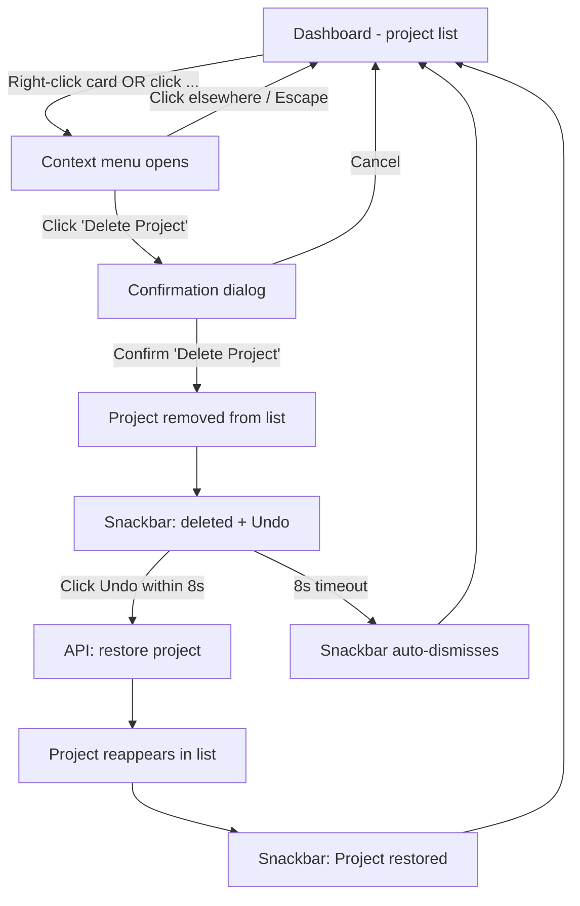

# Narrex -- UX Design: Project Deletion

**Status:** Draft
**Author:** zzoo
**Last Updated:** 2026-03-09
**Parent UX Doc:** docs/ux-design.md

---

## 1. Context

### User Goal (JTBD)

**"When I want to remove a project I no longer need, I want to delete it safely and quickly, so I can keep my dashboard organized without fear of losing important work."**

The user's goal is NOT "click a delete button." It is to maintain a clean, organized project list while being confident that accidental deletion is recoverable. This is a housekeeping action, not a core creative task.

### User Context

- **Device:** Desktop (Narrex currently blocks mobile with a viewport gate)
- **Environment:** At home on a laptop, during a creative session or between sessions
- **Mental state:** Administrative -- the user is organizing, not deeply focused on writing
- **Risk level:** HIGH. A project can represent hours or days of creative work (story structure, scenes, drafts). Accidental permanent loss would be devastating.

### Constraints

- API already supports soft-delete (`DELETE /v1/projects/{projectId}` sets `deleted_at = now()`)
- Web client has `deleteProject(projectId)` function ready
- Existing UI components available: `Dialog` (confirmation), `ContextMenu` (right-click actions)
- Two locales: ko (primary), en
- Desktop-only (mobile viewport gate already exists)

---

## 2. Information Architecture

### Where Delete Lives

Delete is a secondary, infrequent action. It must be accessible but never compete with primary actions (creating projects, opening projects, writing).

**Dashboard (primary location):**
- Right-click context menu on project cards -- the standard desktop discovery pattern
- "More actions" overflow button (three-dot icon) on each project card -- the visible alternative for users who do not right-click

**Workspace (secondary location):**
- NOT included in Phase 1. Rationale: users rarely want to delete the project they are actively editing. Adding a delete action inside the workspace creates an unnecessary risk of accidental destruction during focused creative work. If needed later, it belongs in a "Project Settings" section, buried behind progressive disclosure.

```
Dashboard
 +-- Project Card
      +-- [click] --> Open workspace
      +-- [right-click] --> Context menu
      |    +-- Open
      |    +-- Rename  (future)
      |    +-- ---
      |    +-- Delete Project
      +-- [three-dot button] --> Same menu (visible alternative)
```

**Justification:**
- Jakob's Law: right-click context menu is the standard desktop pattern for secondary actions on list items (Finder, VS Code, Notion, Google Drive all use this)
- Fitts's Law: keeping delete away from the primary click target (which opens the project) prevents accidental activation
- Hick's Law: the context menu has minimal options (Open, separator, Delete Project), reducing decision time

---

## 3. User Flow

### Critical Path: Delete a Project

```
Dashboard (loaded state)
  |
  +-- User right-clicks a project card (or clicks three-dot button)
  |
  +-- Context menu appears with "Delete Project" option (red/danger styled)
  |
  +-- User clicks "Delete Project"
  |
  +-- Confirmation dialog appears
  |     - Title: "Delete '{project title}'?" (includes project name for specificity)
  |     - Body: consequence description + recovery info
  |     - Buttons: [Cancel] [Delete Project]
  |
  +-- User clicks "Delete Project" (red/danger button)
  |
  +-- Dialog closes
  +-- Project card animates out (fade + collapse, 250ms)
  +-- Snackbar appears at bottom: "'{project title}' deleted" [Undo]
  |     - 8-second auto-dismiss window
  |
  +-- IF user clicks [Undo] within 8 seconds:
  |     - API call to restore the project (PATCH with deleted_at: null, or dedicated restore endpoint)
  |     - Project card animates back in
  |     - Snackbar updates: "Project restored"
  |
  +-- IF 8 seconds pass without undo:
  |     - Snackbar auto-dismisses
  |     - Soft-delete remains (server retains data for 30 days)
  |     - No further UI indication needed
  |
  DONE
```

### Flow Diagram (Mermaid)



### Edge Cases

| Edge Case | Handling |
|-----------|----------|
| **Deleting the only project** | After deletion + card animation, show the empty state ("No projects yet" + CTA). If user undoes, card reappears and empty state hides. |
| **API failure on delete** | Show error toast: "Could not delete project. Try again." Project card remains. Dialog closes. No partial state. |
| **API failure on undo/restore** | Show error toast: "Could not restore project. Try again." Provide a "Try Again" action in the toast. |
| **Double-click on delete** | Dialog absorbs the second click. Confirm button shows loading state (spinner) after first click, preventing double-submission. |
| **Network timeout during delete** | Same as API failure. Abort controller with 10s timeout. Show error toast. |
| **User navigates away during snackbar** | No issue -- soft-delete is already committed server-side. Undo opportunity is lost but data is retained server-side for 30 days. |
| **Multiple rapid deletions** | Snackbars queue (one at a time). Each has its own 8s undo window. Previous snackbar is dismissed when a new one appears, but the undo window for the previous deletion has already closed. |
| **Deleting while project is open in another tab** | Not handled in Phase 1 (single-user, no real-time sync). The other tab will show stale data until refreshed. |
| **Extremely long project title** | Truncate with ellipsis in both the dialog and snackbar. Max display: ~40 characters + "..." |

---

## 4. Screen Specifications

### 4.1 Dashboard -- Project Card (Modified)

**Change:** Add a three-dot overflow button and wrap each card in a ContextMenu.

**Primary action:** Open project (click/tap on card -- unchanged)
**Secondary action:** Context menu (right-click or three-dot button)

#### Three-Dot Button Placement

```
+---------------------------------------+
| Project Title                     ... |  <-- three-dot button, top-right corner
|                                       |
| [Fantasy]  3/12 scenes drafted        |
| |========-------|                     |
| Last edited: Mar 5                    |
+---------------------------------------+
```

**Interaction:**
- Button appears on hover (desktop). Always visible would add visual noise.
- On hover: `opacity: 0 -> 1` transition, 150ms
- Focus-visible: always shown (keyboard accessibility)
- Click: opens same menu as right-click context menu
- Touch area: 32x32px minimum (desktop-only, but still usable with trackpad click)

**Justification:**
- Von Restorff Effect: keeping the button hidden by default ensures the primary visual focus remains on the project title and progress
- Fitts's Law: placed in the top-right corner, away from the main click target area
- Accessibility: focus-visible ensures keyboard users always see it

#### Context Menu Items

| Order | Label (ko) | Label (en) | Icon | Style | Action |
|-------|-----------|-----------|------|-------|--------|
| 1 | 열기 | Open | none | default | Navigate to workspace |
| -- | --- | --- | --- | separator | --- |
| 2 | 프로젝트 삭제 | Delete Project | IconTrash (16px) | danger (red text) | Open confirmation dialog |

**States:**

| State | Behavior |
|-------|----------|
| Default | Menu items idle |
| Hover | Background highlight (surface for normal, error-muted for danger) |
| Focus (keyboard) | Same as hover + focus ring |
| Disabled | Not applicable in Phase 1 (no disabled states needed) |

### 4.2 Confirmation Dialog

**Purpose:** Prevent accidental deletion of creative work. This is a destructive action on high-value content.

**Justification for using a dialog (not just undo):**
- The interaction-patterns reference specifies: "Reversible, medium-stakes" actions warrant both a confirmation dialog AND a Recently Deleted / undo mechanism
- A creative project represents significant user investment -- higher stakes than archiving an email
- The dialog + undo combination provides two safety layers: one before (dialog) and one after (undo snackbar)
- Anti-pattern check: the dialog is NOT "Are you sure?" -- it names the specific project and describes consequences

#### Dialog Content

```
+-------------------------------------------+
|                                           |
|  '{project title}' 프로젝트를 삭제할까요?  |
|                                           |
|  프로젝트의 모든 장면, 등장인물, 초고가     |
|  삭제됩니다.                               |
|                                           |
|              [취소]  [프로젝트 삭제]        |
|                                           |
+-------------------------------------------+
```

#### UX Copy

**Title:**

| Locale | Copy |
|--------|------|
| ko | `'{title}' 프로젝트를 삭제할까요?` |
| en | `Delete '{title}'?` |

**Description:**

| Locale | Copy |
|--------|------|
| ko | `프로젝트의 모든 장면, 등장인물, 초고가 삭제됩니다.` |
| en | `All scenes, characters, and drafts in this project will be deleted.` |

**Confirm button:**

| Locale | Copy |
|--------|------|
| ko | `프로젝트 삭제` |
| en | `Delete Project` |

**Cancel button:**

| Locale | Copy |
|--------|------|
| ko | `취소` |
| en | `Cancel` |

**Justification:**
- UX Writing Verb Rule: confirm button says "Delete Project" (specific verb + object), not "OK" or "Yes" or "Confirm"
- UX Writing Tone: anxious user state -> reassuring, transparent. The description plainly states what will be lost.
- The title includes the project name so the user can verify they selected the correct project (prevents wrong-target errors)
- We intentionally do NOT say "This cannot be undone" because it CAN be undone (soft-delete with undo snackbar). Saying otherwise would be dishonest and create unnecessary anxiety (Peak-End Rule: avoid making the worst moment worse than necessary)

#### Dialog States

| State | Behavior |
|-------|----------|
| Open | Backdrop blur + fade in (existing Dialog animation). Focus trapped. Cancel button focused by default (existing behavior -- safe default). |
| Confirming | "Delete Project" button shows loading spinner. Both buttons disabled. Prevents double-submission. |
| Error | Dialog stays open. Inline error message appears: "Could not delete. Try again." Buttons re-enable. |
| Closed | Focus returns to the trigger element (three-dot button or card). Existing Dialog behavior handles this. |

### 4.3 Snackbar (Post-Delete Feedback)

**Position:** Bottom-center of the screen, 24px above viewport bottom
**Duration:** 8 seconds auto-dismiss (extended from standard 3-5s because undo is available for a high-stakes action)

```
+-------------------------------------------+
|                                           |
|         Dashboard content                 |
|                                           |
+-------------------------------------------+
|  '{title}' 삭제됨                  [실행 취소]  |
+-------------------------------------------+
```

#### UX Copy

**Snackbar message (delete):**

| Locale | Copy |
|--------|------|
| ko | `'{title}' 삭제됨` |
| en | `'{title}' deleted` |

**Undo button:**

| Locale | Copy |
|--------|------|
| ko | `실행 취소` |
| en | `Undo` |

**Snackbar message (restore success):**

| Locale | Copy |
|--------|------|
| ko | `프로젝트가 복원되었습니다` |
| en | `Project restored` |

**Snackbar message (restore failure):**

| Locale | Copy |
|--------|------|
| ko | `프로젝트를 복원할 수 없습니다. 다시 시도하세요.` |
| en | `Could not restore project. Try again.` |

#### Snackbar States

| State | Behavior |
|-------|----------|
| Visible | Slides up from bottom, 300ms ease-out. Timer bar animates from full to empty (8s). |
| Undo clicked | Snackbar text changes to "Restoring..." with spinner. API call fires. On success: "Project restored" for 3s. On failure: error message with "Try Again" action. |
| Auto-dismiss | Fades out, 250ms ease-in. |
| Interrupted (new snackbar) | Current snackbar dismissed immediately. New one takes its place. |

#### Snackbar Design Spec

- Background: `var(--color-surface-raised)`
- Border: `1px solid var(--color-border-default)`
- Text: `var(--color-fg)` for message, `var(--color-accent)` for Undo button
- Shadow: `shadow-xl shadow-black/30`
- Border radius: `rounded-lg` (8px)
- Padding: `px-4 py-3`
- Max width: 420px, centered
- Z-index: 9997 (below Dialog and ContextMenu)
- Timer indicator: 2px height bar at bottom of snackbar, `var(--color-accent)` shrinking from left to right over 8 seconds

### 4.4 Dashboard States After Deletion

| State | Behavior |
|-------|----------|
| **Multiple projects remain** | Deleted card animates out (opacity 0 + height collapse, 250ms). Grid re-flows. |
| **Last project deleted** | Card animates out. Empty state fades in after 250ms delay: "No projects yet" + "Create Your First Project" CTA. This is the existing empty state -- no new design needed. |
| **Undo restores last project** | Empty state fades out. Card animates back in (opacity 1 + height expand, 250ms). |
| **Undo restores one of many** | Card animates back in at its original position. Grid re-flows. |

#### Card Removal Animation

```css
/* Card exit */
.card-exiting {
  opacity: 0;
  transform: scale(0.95);
  transition: opacity 200ms ease-in, transform 200ms ease-in;
}

/* Card re-enter (undo) */
.card-entering {
  animation: card-enter 250ms ease-out;
}

@keyframes card-enter {
  from {
    opacity: 0;
    transform: scale(0.95);
  }
  to {
    opacity: 1;
    transform: scale(1);
  }
}
```

Respect `prefers-reduced-motion`: replace with instant visibility toggle.

---

## 5. New Component: Snackbar

The existing codebase does not have a Snackbar/Toast component. This feature requires one.

### Component API

```tsx
interface SnackbarProps {
  message: string
  action?: {
    label: string
    onClick: () => void
  }
  duration?: number        // ms, default 5000
  onDismiss?: () => void
}
```

### Behavior Rules (from interaction-patterns.md)

- Position: bottom-center of screen, above any fixed bottom UI
- Auto-dismiss: configurable duration (default 5s, 8s for delete undo)
- One at a time: queue if multiple triggered
- Never use for errors (errors need persistent visibility) -- errors show inline or in dialogs
- Include undo action for reversible operations

### Suggested Location

`apps/web/src/shared/ui/snackbar.tsx`

Export from `apps/web/src/shared/ui/index.ts`.

---

## 6. i18n Keys Required

Add to `apps/web/src/shared/lib/i18n.tsx`:

### Korean (ko)

```
'dashboard.menu.open': '열기'
'dashboard.menu.deleteProject': '프로젝트 삭제'
'dashboard.deleteConfirm.title': "'{title}' 프로젝트를 삭제할까요?"
'dashboard.deleteConfirm.description': '프로젝트의 모든 장면, 등장인물, 초고가 삭제됩니다.'
'dashboard.deleteConfirm.confirm': '프로젝트 삭제'
'dashboard.deleteSnackbar.deleted': "'{title}' 삭제됨"
'dashboard.deleteSnackbar.restored': '프로젝트가 복원되었습니다'
'dashboard.deleteSnackbar.restoreFailed': '프로젝트를 복원할 수 없습니다. 다시 시도하세요.'
'dashboard.deleteError': '프로젝트를 삭제할 수 없습니다. 다시 시도하세요.'
```

### English (en)

```
'dashboard.menu.open': 'Open'
'dashboard.menu.deleteProject': 'Delete Project'
'dashboard.deleteConfirm.title': "Delete '{title}'?"
'dashboard.deleteConfirm.description': 'All scenes, characters, and drafts in this project will be deleted.'
'dashboard.deleteConfirm.confirm': 'Delete Project'
'dashboard.deleteSnackbar.deleted': "'{title}' deleted"
'dashboard.deleteSnackbar.restored': 'Project restored'
'dashboard.deleteSnackbar.restoreFailed': 'Could not restore project. Try again.'
'dashboard.deleteError': 'Could not delete project. Try again.'
```

---

## 7. Accessibility Notes

### Keyboard Navigation

1. **Tab to three-dot button:** Each project card's three-dot button is in the natural tab order (after the card link itself).
2. **Enter/Space on three-dot button:** Opens context menu.
3. **Arrow keys in context menu:** Navigate between menu items (already implemented in `ContextMenu` component).
4. **Enter/Space on menu item:** Activates the item.
5. **Escape:** Closes context menu, then closes dialog if open. Already handled.
6. **Tab in dialog:** Focus trapped between Cancel and Delete Project buttons (existing Dialog behavior).
7. **Focus return:** When dialog closes, focus returns to the three-dot button that triggered it (existing Dialog behavior via `previousFocus`).

### Screen Reader

- Three-dot button: `aria-label` = "Project actions" / "프로젝트 작업" (not just "More")
- Context menu: `role="menu"` with `role="menuitem"` on items (already implemented)
- Dialog: `role="dialog"` with `aria-modal="true"`, `aria-labelledby`, `aria-describedby` (already implemented)
- Snackbar: `role="status"` with `aria-live="polite"` -- announces the message without interrupting
- Undo action in snackbar: must be keyboard-focusable (button element, not just styled text)

### Contrast

- Danger/red text in context menu and dialog button: verify `var(--color-error)` against `var(--color-surface-raised)` background meets 4.5:1 ratio
- Snackbar text against snackbar background: verify 4.5:1 ratio
- Accent-colored Undo button text: verify against snackbar background

### Reduced Motion

- Card exit/enter animations: replace with instant opacity toggle when `prefers-reduced-motion: reduce`
- Snackbar slide animation: replace with instant visibility
- Timer bar animation: still show (it is functional, not decorative), but use a discrete step instead of smooth animation

---

## 8. Design Rationale

### Key Decisions

| Decision | Rationale | Principle |
|----------|-----------|-----------|
| **Context menu + three-dot button (not inline delete button on card)** | Delete is a secondary, infrequent action. Placing it in a context menu keeps the card clean and reduces accidental activation. The three-dot button provides a visible alternative for discoverability. | Jakob's Law (standard desktop pattern), Fitts's Law (distance from primary target), Hick's Law (fewer visible choices on the card) |
| **Confirmation dialog before delete** | Although soft-delete is reversible, a project represents significant creative investment. The dialog provides a moment of reflection and names the specific project being deleted. | Interaction Patterns: "Reversible, medium-stakes" warrants dialog + undo. Cognitive Load: naming the project in the title reduces error by forcing recognition. |
| **Undo snackbar after delete** | Provides a second safety net after the dialog. 8-second window gives users time to realize a mistake without requiring them to navigate to a "Recently Deleted" section. | Interaction Patterns: Soft Delete Pattern + snackbar with undo. Peak-End Rule: the "end" of the deletion flow is positive -- user has control and can reverse. |
| **No "Recently Deleted" section in Phase 1** | The undo snackbar + server-side 30-day retention is sufficient for Phase 1. A dedicated "Trash" view adds UI complexity without proportional user value at low project volumes. | First Principles: minimum needed to achieve the goal. |
| **Delete NOT available in workspace** | Users are in deep focus (writing) when in the workspace. A delete action here is high-risk for accidental activation and serves no urgent need. | Cognitive Load: do not introduce destructive actions during focused creative work. |
| **Three-dot button appears on hover only** | Reduces visual clutter on the dashboard. The cards are visual-first (title, genre, progress). Secondary actions hide behind hover. | Von Restorff Effect: keep visual focus on primary content. Accessible via keyboard focus-visible. |
| **Dialog title includes project name** | Prevents wrong-target errors. User can verify they selected the correct project before confirming. | Cognitive Load: recognition over recall. UX Writing: be specific about what will happen. |
| **No "Are you sure?" or "This cannot be undone"** | Anti-pattern: "Are you sure?" is vague. Anti-pattern: "This cannot be undone" would be a lie since it IS reversible (soft-delete). Instead, we describe what will be lost (scenes, characters, drafts). | UX Writing anti-patterns. Honest, transparent copy. |

### What Was Removed

| Element | Why Removed |
|---------|-------------|
| Swipe-to-delete on cards | Desktop-only app. Swipe is a mobile pattern. Violates Jakob's Law for desktop. |
| Permanent delete confirmation (type project name) | Soft-delete with undo makes this unnecessary. Reserved for truly irreversible actions (account deletion). |
| "Recently Deleted" / Trash view | Phase 1 scope: undo snackbar + server 30-day retention is sufficient. Can add later if users request. |
| Delete button inside workspace | High-risk during focused creative work. No urgent need. |
| Batch selection + delete | Phase 1 scope: users have few projects. Batch delete adds complexity without proportional value. |
| "Archive" as alternative to delete | Added complexity. Users have a simple mental model: keep or remove. "Archive" introduces a third state. |

### Open Questions

1. **Restore API endpoint:** Does the backend currently support restoring a soft-deleted project? If not, a `PATCH /v1/projects/{projectId}/restore` endpoint is needed for the undo flow. Alternatively, the frontend could "fake" undo by delaying the API call until the snackbar undo window expires -- but this risks data inconsistency if the user closes the browser.
2. **30-day permanent deletion:** Should there be a background job that permanently deletes projects after 30 days? This is a backend concern but affects UX if users expect data recovery beyond the undo window.
3. **Future: "Recently Deleted" view:** If Narrex grows to handle many projects, a dedicated Trash view may be warranted. Defer to Phase 2+.

---

## 9. Implementation Checklist

### New Components
- [ ] `Snackbar` component (`shared/ui/snackbar.tsx`) -- with timer bar, action slot, auto-dismiss, queue
- [ ] Export `Snackbar` from `shared/ui/index.ts`

### Modified Components
- [ ] `DashboardView` -- wrap each project card in `ContextMenu`, add three-dot overflow button, add delete confirmation dialog, add snackbar for post-delete feedback
- [ ] `i18n.tsx` -- add all new translation keys listed in Section 6

### API (if needed)
- [ ] Verify or add project restore endpoint for undo functionality

### Accessibility QA
- [ ] Keyboard: Tab -> three-dot button -> Enter -> menu -> Arrow -> Enter on Delete -> Tab in dialog -> Confirm/Cancel
- [ ] Screen reader: verify announcements for context menu, dialog, snackbar
- [ ] Contrast: verify error/danger colors against backgrounds

---

## 10. Validation: Quick Checklist

### Goal and Structure
- [x] User's ONE goal clearly identified (JTBD statement written)
- [x] Every element passes "does this help the goal?" test
- [x] Information architecture validated (delete accessible in 2 clicks from dashboard)
- [x] Navigation pattern appropriate (context menu for secondary actions on list items)

### Screen Design
- [x] Primary action is ONE and visually dominant per screen (card click = open; dialog confirm = delete)
- [x] Information shown is only what is needed (dialog: project name + consequence)
- [x] States designed: context menu open/closed, dialog open/confirming/error/closed, snackbar visible/undo/dismissed, card exiting/entering
- [x] Content hierarchy: project name first in dialog title

### Interaction
- [x] Feedback exists for every user action (menu open, dialog open, card exit animation, snackbar)
- [x] Destructive action requires confirmation (dialog) AND offers undo (snackbar)
- [x] Loading pattern: dialog confirm button shows spinner during API call
- [x] Gestures have visible alternatives (right-click -> three-dot button)

### Copy
- [x] Button labels are specific verbs ("Delete Project", not "OK" or "Yes")
- [x] Error messages: what happened + how to fix ("Could not delete project. Try again.")
- [x] No jargon, no technical language
- [x] Both locales (ko, en) specified for all copy

### Platform and Ergonomics
- [x] Desktop: context menu + dialog is the standard pattern
- [x] Hover states used appropriately (three-dot button reveal)
- [x] Responsive: desktop-only (mobile gated at app level)

### Accessibility
- [x] Contrast ratios: flagged for verification
- [x] Color not sole indicator (danger items have icon + red text + position)
- [x] Focus states: existing Dialog focus trap, ContextMenu arrow key nav
- [x] Screen reader labels specified
- [x] `prefers-reduced-motion` respected for animations

### Anti-patterns
- [x] No "Are you sure?" (uses specific action + consequence instead)
- [x] No color-only indicators
- [x] No hover-only interactions (three-dot visible on focus-visible)
- [x] Cognitive principles cited for all key decisions
